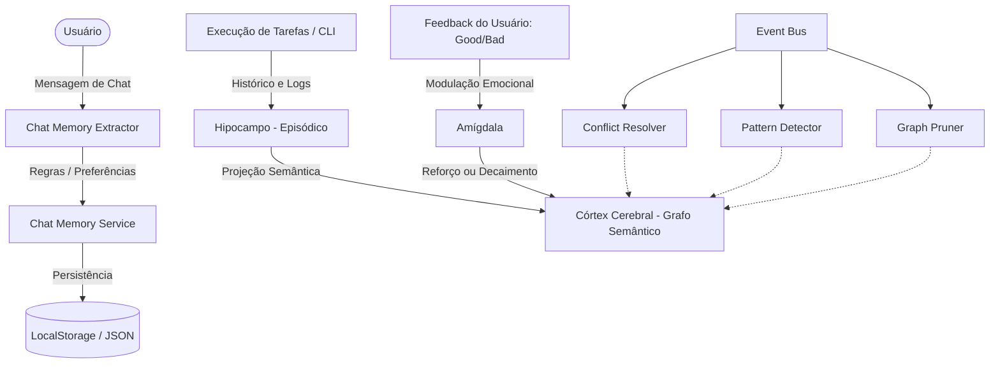

# 🤖 kaoz.1 — Agente de IA com Córtex Cognitivo e Orquestrador de Ferramentas (MCP)

**kaoz.1** é uma **Agente Autônoma de IA e Assistente Cognitiva Pessoal**. Equipada com uma arquitetura de memória persistente inspirada na estrutura cerebral humana e integração com o **Model Context Protocol (MCP)**, ela é capaz de executar tarefas locais de CLI, interagir com serviços web, gerenciar dispositivos e aplicativos de uso diário (como o Spotify) e aprender continuamente com base nas suas preferências e feedback.

---

## 🧠 Arquitetura do Córtex Cognitivo (Cognitive Memory)

A **kaoz.1** possui um sistema de aprendizado dinâmico e contínuo que armazena, associa e decai conceitos de acordo com o uso diário.



### Subsistemas de Memória
*   **Hipocampo (Episódico):** Registra as experiências em tempo de execução. Salva o histórico de tarefas criadas, roteiros gerados, prompts executados e os resultados das ferramentas em detalhes estruturados.
*   **Córtex Cerebral (Grafo Semântico):** Organiza o conhecimento em nós e conexões (entidades, conceitos e relações). Cada conceito possui um nível de confiança e uma taxa de relevância.
*   **Amígdala (Modulação de Importância):** Se você der um feedback positivo (`good`) ou negativo (`bad`) sobre a execução de uma tarefa ou resposta de chat, a Amígdala ajusta o peso emocional e a confiança daquela informação no grafo, reforçando acertos e esquecendo erros.
*   **Barramento de Eventos (Conflict Resolver, Pattern Detector & Graph Pruner):**
    *   **Conflict Resolver:** Resolve contradições lógicas criadas por mudanças nas preferências do usuário.
    *   **Pattern Detector:** Identifica padrões de falha repetitivos em execuções de avatares ou comandos.
    *   **Graph Pruner:** Executa a compressão e o decaimento gradual de conexões pouco utilizadas no grafo de memória para otimizar o consumo de contexto das LLMs.

---

## 💬 Extração Contínua de Preferências (Chat Memory Extractor)

Durante o uso do Chat, a **kaoz.1** analisa e extrai regras implícitas e explícitas que você diz na conversa:
*   **Detecção de Padrões:** Frases como *"não faça mais [X]"*, *"sempre que [Y], execute [Z]"*, *"prefiro usar [W]"* ou *"lembre-se que neste projeto [V]"* são detectadas imediatamente, categorizadas (como regras de workflow, preferências de estilo, correções ou fatos de projeto) e salvas em sua memória de longo prazo.
*   **Redação Sensível Automatizada:** Um filtro ativo intercepta chaves de API, senhas, tokens de segurança, CPFs e dados financeiros nas mensagens, impedindo que dados críticos sejam registrados no Grafo Semântico.

---

## 🔌 Orquestração de Ferramentas & Model Context Protocol (MCP)

A Agente utiliza o **Model Context Protocol (MCP)** para se transformar em um hub de ferramentas unificado:
*   **Integração Spotify:** Comandos diretos de reprodução em linguagem natural (ex: *"toca aquela música indie no Spotify"* ou *"cria uma playlist chamada Foco"*). A agente interage via MCP para listar dispositivos ativos, tocar, pausar, gerenciar volume, adicionar na fila e montar playlists.
*   **Pesquisas Financeiras e Web:** Ferramentas integradas de scraping rápido na internet (`quick-web-search.ts`) e consultas dinâmicas de cotação de moedas (ex: cotação USD/BRL).
*   **Execução de CLI Local:** Capacidade de gerar e gerenciar subprocessos de linha de comando no sistema operacional local de forma inteligente e monitorável.

---

## 🎬 Estúdio de Criação UGC (Legacy Feature)

Mesmo com foco em orquestração geral de tarefas, a suíte de vídeo original continua 100% ativa:
*   **Pesquisa Viral:** Ferramenta interna em `/viral-search` para monitorar oportunidades e tópicos quentes no TikTok, Instagram e YouTube.
*   **Cadastro de Avatares:** Permite registrar avatares autorizados com foto, vídeo base e voz customizada.
*   **Pipeline de Vídeo em Background:**
    *   Gera roteiro adaptado para a plataforma de destino.
    *   Sintetiza voz realista via OmniVoice ou Fish Audio.
    *   Executa sincronia labial (lip-sync) com MuseTalk 1.5.
    *   Processa e recorta o fundo do expert com Python (`rembg`, `onnxruntime`).
    *   Monta a renderização final no formato vertical via `ffmpeg`.

---

## 🛠️ Stack Tecnológica

*   **Frontend & API:** Next.js 16 (App Router) + React 19 + TypeScript + Tailwind CSS + Framer Motion.
*   **Agentes & Orquestração:** SDK do Model Context Protocol (MCP), Playwright para automação de navegadores em LLMs gratuitas, integração direta com Gemini e OpenAI.
*   **Voz & Áudio:** Fish Audio TTS, Cartesia.js, OmniVoice (via Gradio Client).
*   **Processamento de Mídia:** FFMpeg/FFProbe local, python-rembg (pillow e onnxruntime para remoção de fundos), `yt-dlp` para downloads de vídeos de referência.

---

## ⚙️ Configuração e Instalação

### 1. Instalar as dependências do Next.js
```bash
npm install
```

### 2. Configurar o ambiente
Copie o arquivo `.env.example` para `.env.local`:
```bash
copy .env.example .env.local
```

Abra o arquivo `.env.local` e configure suas credenciais. Principais variáveis:
```env
# Workspace ID de teste padrão
APP_WORKSPACE_ID=00000000-0000-4000-8000-000000000001

# Chaves de IA & LLMs
OPENAI_API_KEY=
# Configurações do Flow & Automação Web (Playwright)
FLOW_HEADLESS=false # false é recomendado para que ChatGPT/Claude/DeepSeek contornem o Cloudflare Turnstile
FLOW_URL=https://flow.google

# Voz e Sintetização
FISH_AUDIO_API_KEY=
OMNIVOICE_API_URL=http://localhost:8000
OMNIVOICE_API_KEY=

# Lip-sync (MuseTalk)
LIPSYNC_ENGINE=musetalk-v15
LIPSYNC_API_URL=http://localhost:8010
LIPSYNC_API_KEY=

# Caminhos locais para renderizadores (Opcional - se não estiverem no PATH global)
FFMPEG_PATH=
FFPROBE_PATH=
YTDLP_PATH=
REMBG_PYTHON_PATH=
```

### 3. Configurar dependências Python (opcional, apenas para o recortador de vídeo)
```bash
python -m pip install rembg pillow onnxruntime
```

### 4. Rodar o servidor de desenvolvimento
```bash
npm run dev
```
Abra o navegador em `http://localhost:3000`.

---

## 📂 Estrutura do Projeto

```text
app/
  api/
    agent-llm/              API de execução e configurações do agente
    cortex/                 API de leitura e controle do Córtex Cognitivo
    flow/chat/              Endpoint de stream do chat interativo da agente com MCP
    fish-audio/             API de síntese de voz Fish Audio
    mcp/                    Gerenciador de ferramentas e conexões MCP
  (dashboard)/
    cortex/                 Visualização interativa do grafo semântico em tempo real
    flow/                   Chat principal de comando e interação com a agente kaoz.1
    avatars/                Controle de avatares para o estúdio UGC
    jobs/                   Status e gerenciamento dos renders de vídeos
    viral-search/           Pesquisa de tendências e referências
components/
  cortex/                   Visualizador gráfico 2D/3D da memória do Córtex
  mrchicken/                Painéis e componentes de IA do chat (Interface da Kaoz.1)
lib/
  cognitive-memory/         Núcleo do Córtex Cognitivo (Hippocampus, Cortex, Amygdala)
  ai/                       Provedores de inteligência (Gemini, OpenAI, Cartesia)
  videos/                   Motores de render, downloader e pipeline de vídeo UGC
services/
  agent-llm/                Serviço de gerenciamento do agente, processos e CLI
  mcp/                      Gerenciamento e comunicação com servidores MCP externos
  spotify/                  Formatador de respostas e mapeamento de comandos Spotify
  web-search/               Mecanismo de busca online integrado
```

---

## Aplicativo para Windows (Electron)

Para abrir a versão desktop durante o desenvolvimento:

```powershell
npm run desktop:dev
```

Para gerar o instalador do Windows:

```powershell
npm run desktop:build
```

O instalador será criado em `release/MrChicken-Setup-<versão>.exe`. A versão
desktop incorpora o servidor Next.js e, portanto, o computador de destino não
precisa ter Node.js nem executar `npm install` ou `npx playwright install`.
As automações usam o Google Chrome instalado no Windows.

Configurações, sessões e arquivos gerados são mantidos em
`%APPDATA%/MrChicken`. Na primeira execução, o aplicativo cria ali um
`.env.local` baseado no `.env.example`; as credenciais também podem ser
configuradas pela tela de Configurações do próprio aplicativo.

## 📝 Notas de Desenvolvimento e Automação

1.  **Sessões do Playwright (Navegador):** A agente usa um Chromium persistente para simular o navegador. Para realizar login em plataformas de chat gratuitas (Gemini, ChatGPT, Claude e DeepSeek) e contornar os desafios do Cloudflare, acesse a página de **Configurações** na aplicação e use a seção de gerenciamento de sessões para fazer o login manual inicial. Os cookies serão gravados localmente em `storage/browser-profile/`.
2.  **OneDrive e Lock de Arquivos (Windows):** O pipeline de vídeo UGC implementa rotinas resilientes com até 5 retentativas no acesso a arquivos locais para contornar problemas de lock temporário causados pela sincronização ativa do OneDrive ou Dropbox.
3.  **Desconexões SSE:** Para garantir o bom uso de memória, as chamadas via SSE Client abertas com os microsserviços são explicitamente terminadas ao fim de cada requisição.
