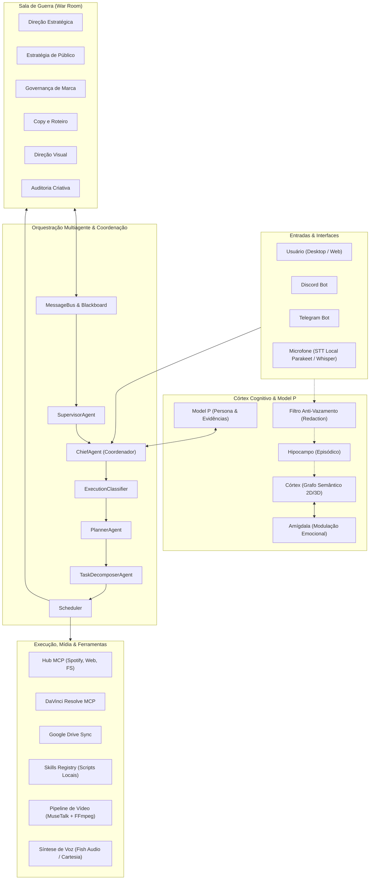

<div align="center">

# ⚡ Kaoz.1
### Autonomous Neuro-Cognitive Operating System & Multi-Agent Creative Studio

*Uma mente autônoma com memória persistente viva, enxame de agentes especializados e controle total do seu desktop, vídeo e comunidade.*

[](https://nextjs.org/)
[](https://react.dev/)
[](https://www.typescriptlang.org/)
[](https://www.electronjs.org/)
[](https://modelcontextprotocol.io/)
[](https://www.blackmagicdesign.com/products/davinciresolve)

[Visão Geral](#-visão-geral) •
[Arquitetura](#-arquitetura-do-sistema) •
[Pilares](#-pilares-do-kaoz1) •
[Navegação & Atalhos](#-navegação--produtividade) •
[Instalação](#-instalação--execução) •
[Documentação](#-documentação-técnica)

---

</div>

## 🚀 Visão Geral

O **Kaoz.1** não é um mero chatbot nem um wrapper superficial de APIs. É um **sistema operacional neurocognitivo pessoal e estúdio criativo autônomo**, projetado para rodar nativamente no Windows e orquestrar fluxos complexos de trabalho com inteligência, memória e ação real.

Inspirado na neurobiologia humana e potencializado pelo **Model Context Protocol (MCP)**, o Kaoz.1 combina:

1. **Memória Orgânica Contínua**: um córtex semântico em grafo 2D/3D que aprende preferências, sintetiza experiências no hipocampo e modula relevância via amígdala com feedback do usuário.
2. **Enxame Multiagente (War Room)**: uma sala de guerra com agentes especializados (estratégia, audiência, governança de marca, copy, direção visual e auditoria) que debatem e constroem campanhas em consenso.
3. **Model P (Personal Cognitive Engine)**: modelagem matemática e comportamental da persona do criador, com inspeção de evidências, scores de confiança e playground de alinhamento de tom.
4. **Estúdio Audiovisual Completo**: integração direta com **DaVinci Resolve** via MCP, sincronização com **Google Drive**, lip-sync neural (**MuseTalk 1.5**), síntese vocal e timeline com atalhos profissionais (J-K-L).
5. **Ecossistema Extensível de Skills**: habilidades modulares em `SKILL.md` + scripts executáveis com governança e testes integrados.
6. **Conectores Omnichannel**: bots bidirecionais integrados para **Discord**, **Telegram** e **Bluesky** com cofre seguro de credenciais locais.
7. **Privacidade e Custo Zero**: transcrição de voz local offline via **Parakeet** (PT-BR) e **Whisper.cpp**, sem depender de APIs pagas de STT.

---

## 🏛️ Arquitetura do Sistema

O Kaoz.1 opera como uma cadeia coordenada e desacoplada, garantindo que nenhum executor monolítico centralize ou trave as operações:


```mermaid
flowchart TB
    subgraph Inbound["Entradas & Interfaces"]
        U["Usuário (Desktop / Web)"]
        DC["Discord Bot"]
        TG["Telegram Bot"]
        MIC["Microfone (STT Local Parakeet / Whisper)"]
    end

    subgraph Core["Orquestração Multiagente & Coordenação"]
        CH["ChiefAgent (Coordenador)"]
        EC["ExecutionClassifier"]
        PL["PlannerAgent"]
        TD["TaskDecomposerAgent"]
        SC["Scheduler"]
        MB["MessageBus & Blackboard"]
        SV["SupervisorAgent"]
    end

    subgraph CreativeDomain["Sala de Guerra (War Room)"]
        DIR["Direção Estratégica"]
        AUD["Estratégia de Público"]
        BRD["Governança de Marca"]
        CPY["Copy e Roteiro"]
        VIS["Direção Visual"]
        REV["Auditoria Criativa"]
    end

    subgraph Memory["Córtex Cognitivo & Model P"]
        HIP["Hipocampo (Episódico)"]
        CTX["Córtex (Grafo Semântico 2D/3D)"]
        AMG["Amígdala (Modulação Emocional)"]
        MDP["Model P (Persona & Evidências)"]
        RED["Filtro Anti-Vazamento (Redaction)"]
    end

    subgraph Tooling["Execução, Mídia & Ferramentas"]
        MCP["Hub MCP (Spotify, Web, FS)"]
        DVR["DaVinci Resolve MCP"]
        GDR["Google Drive Sync"]
        SKL["Skills Registry (Scripts Locais)"]
        VID["Pipeline de Vídeo (MuseTalk + FFmpeg)"]
        TTS["Síntese de Voz (Fish Audio / Cartesia)"]
    end

    Inbound --> CH
    CH --> EC
    EC --> PL
    PL --> TD
    TD --> SC
    SC --> CreativeDomain
    CreativeDomain <--> MB
    SC --> Tooling
    MB --> SV
    SV --> CH

    Inbound -.-> RED
    RED -.-> HIP
    HIP -.-> CTX
    CTX <--> AMG
    MDP <--> CH
```

---

## ⚡ Pilares do Kaoz.1

### 🧠 1. Córtex Cognitivo (Memória Viva Persistente)
O cérebro do Kaoz.1 não apaga seu contexto quando a conversa encerra. Ele processa e organiza continuamente tudo o que você ensina:
* **Hipocampo (Memória Episódica):** Registra cada tarefa executada, comandos de terminal, roteiros montados e retornos de ferramentas.
* **Córtex Cerebral (Grafo Semântico 2D/3D):** Transforma conhecimento em uma malha relacional viva visível em `/cortex`. Nós e arestas representam entidades, conceitos, decisões e regras.
* **Amígdala (Modulação de Relevância e Feedback):** Ajusta pesos neurais a cada feedback (`good` / `bad`). Acertos são reforçados; abordagens inadequadas sofrem decaimento gradual.
* **Resolutor de Conflitos & Poda (Graph Pruner):** Identifica contradições lógicas quando suas preferências mudam e comprime conexões frias para manter as chamadas de contexto das LLMs hiperotimizadas.
* **Redação Ativa de Segredos:** Filtro em tempo real que bloqueia senhas, API keys, dados bancários e CPFs antes que qualquer nó de memória seja gravado.

---

### 🧬 2. Model P (Personal Cognitive Engine & Personas)
Seu estilo, suas regras, sua voz. O **Model P** é o subsistema dedicado a manter a coerência da sua marca pessoal ou das suas personas de conteúdo:
* **Perfis de Persona (ex: Lorenzo Ancestral):** Define tom de voz (firme, provocativo, empático, técnico), jargões característicos, crenças fundamentais, regras de audiência e limites éticos estritos.
* **Score de Confiança & Inspeção de Evidências:** Cada fato memorizado sobre a persona possui um percentual de confiança (Alta, Média, Baixa) com rastro de auditoria — você inspeciona exatamente qual interação gerou aquele aprendizado.
* **Persona Playground:** Ambiente interativo em `/model-p` para testar cenários, simular reações e ajustar o comportamento do agente em tempo real antes de enviar para produção.

---

### ⚔️ 3. Sala de Guerra Multiagente (War Room & Supervisão)
Criação estratégica de conteúdo não deve ser feita por um prompt único. O Kaoz.1 invoca uma banca de agentes especializados operando sob o **CreativeDomain**:
* 👑 **Direção Estratégica (`campaign-director`):** Define objetivos de campanha, posicionamento e tom geral.
* 🎯 **Estratégia de Público (`audience-strategist`):** Mapeia dores, personas-alvo e ganchos de retenção.
* 🛡️ **Governança de Marca (`brand-governance`):** Valida conformidade com diretrizes do criador, tom de voz e regras éticas.
* ✍️ **Copy e Roteiro (`copywriter`):** Elabora scripts magnéticos, ganchos de 3 segundos e chamadas para ação (CTA).
* 🎨 **Direção Visual (`visual-director`):** Define estilo estético, sugestões de enquadramento, cortes e ritmo de edição.
* 🔍 **Auditoria Criativa (`creative-reviewer`):** Avalia os artefatos gerados, aprova consenso (*"Consenso alcançado"*) ou solicita refinamento direcionado.

Acompanhe todo o debate ao vivo, com histórico de decisões e artefatos gerados na tela de **Supervisão** (`/supervision`).

---

### 🎬 4. Estúdio de Vídeo & DaVinci Resolve MCP
Uma suíte audiovisual completa, unindo automação com controle fino:
* **Integração Nativa DaVinci Resolve:** Controle o DaVinci Resolve direto pelo Kaoz.1 via MCP (criação de projetos, timelines, inserção de clipes, exportações automatizadas).
* **Controle de Mídias via Google Drive:** Listagem, download e sincronização em lote de assets de vídeo e b-rolls direto da nuvem.
* **Controles de Ilha Profissional:** Player com atalhos clássicos de transporte (`J` retrocede, `K` pausa, `L` avança, `Espaço`, navegação por frames e marcadores).
* **Pipeline de Lip-Sync Neural:** Geração de voz ultra-realista + sincronização labial via **MuseTalk 1.5**, recorte de fundo assistido por IA (`rembg` + ONNX) e render vertical FFmpeg resiliente contra locks de disco do OneDrive/Dropbox.

---

### 🧩 5. Ecossistema Extensível de Skills
O Kaoz.1 é expansível através do seu padrão aberto de habilidades locais:
* Cada skill reside em `skills/<nome-da-skill>/` e conta com:
  * `SKILL.md`: Metadados em frontmatter YAML (nome, descrição, ferramentas, versão) e instruções de comportamento para o agente.
  * `scripts/`: Implementações executáveis em TypeScript, JavaScript ou Python.
* **Skills Nativas Inclusas:**
  * `davinci.resolve`: Automação da API do DaVinci Resolve Studio & Free.
  * `analisador-de-metricas`: Extração e análise profunda de retenção e métricas de engajamento.
  * `gerador-de-hashtags`: Clusterização de tags virais por nicho e algoritmo.
  * `criador-de-legendas-virais`: Formatação de descrições magnéticas com ganchos e CTAs.
  * `criador-de-logos` & `logo-grid-preview`: Geração de conceitos visuais e grids de identidade.
  * `pdf-document-builder`: Compilação de relatórios e documentos estruturados em PDF.
  * `trend-hunter` & `research.web-research`: Mineração ativa de tendências e referências online.
* **Gerenciador Visual:** Visualize, ative, configure e crie novas skills direto na aba **Skills** em `/settings`.

---

### 📡 6. Conectores Omnichannel Nativos (Discord, Telegram & Bluesky)
Leve seu agente para onde sua comunidade está:
* **Discord Inbound & Gateway:** Conexão direta via WebSocket Gateway, suporte a slash commands, respostas em threads e formatação rica de mensagens.
* **Telegram Polling & Media:** Conexão contínua sem necessidade de webhooks públicos, processamento de áudios, imagens e comandos diretos.
* **ConnectorVault Criptografado:** Chaves e tokens das plataformas são salvos com cifragem local, garantindo que suas credenciais permaneçam seguras.

---

### 🎙️ 7. Áudio Expressivo & Transcrição Local Offline
* **Parakeet Local STT (PT-BR):** Transcrição de fala local de altíssima precisão treinada para o português brasileiro. Modelo de ~670 MB baixado sob demanda e executado totalmente offline na sua máquina — **sem custos de API e com máxima privacidade**.
* **Whisper.cpp Runtime:** Alternativa C++ ultra-rápida e leve para transcrição imediata de áudios.
* **Síntese Vocal Avançada:** Suporte integrado a **Fish Audio**, **Cartesia** e **OmniVoice** com controle de entonação e timing.

---

## 🗺️ Navegação & Produtividade

### Rotas da Aplicação

| Rota | Módulo | Descrição |
| :--- | :--- | :--- |
| `/flow` | **Kaoz.1 (Flow)** | Chat conversacional principal com Live Canvas, execução de comandos e artefatos. |
| `/supervision` | **Supervisor** | Sala de Guerra multiagente, debate criativo de campanhas e supervisão de tarefas. |
| `/cortex` | **Córtex Cognitivo** | Visualização interativa 2D/3D do Grafo Semântico, memórias do chat e hipocampo. |
| `/model-p` | **Model P** | Painel da Persona, inspetor de evidências, scores de confiança e playground. |
| `/video` | **Edição de Vídeo** | Console audiovisual, integração DaVinci Resolve, Google Drive e lip-sync. |
| `/settings` | **Configurações** | Provedores LLM, servidores MCP, catálogo de Skills, bots e sessões web. |

### Atalhos de Teclado Essenciais

| Atalho | Ação |
| :--- | :--- |
| `Alt + 1` | Navegar para o **Kaoz.1 (Flow)** |
| `Alt + 2` | Navegar para o **Supervisor (War Room)** |
| `Alt + 3` | Navegar para o **Córtex Cognitivo** |
| `Alt + 4` | Navegar para a **Edição de Vídeo** |
| `Alt + 5` | Navegar para as **Configurações** |
| `Alt + 6` | Navegar para o **Model P** |
| `Ctrl + K` / `Cmd + K` | Abrir a **Command Palette** global |
| `Ctrl + B` / `Cmd + B` | Recolher / Expandir barra lateral |
| `?` | Exibir o painel de atalhos rápidos (Cheatsheet) |
| `J` / `K` / `L` | *(Na tela de Vídeo)* Shuttle reverso / Pausa / Shuttle avanço rápido |
| `Espaço` | *(Na tela de Vídeo)* Play / Pause |

---

## ⚙️ Instalação & Execução

### Pré-requisitos
* **Node.js**: v20+ ou v22 LTS
* **Python** (opcional, para renderização local e remoção de fundo): v3.10+
* **FFmpeg / FFprobe**: no PATH do sistema operacional (ou configurado no `.env.local`)
* **DaVinci Resolve Studio ou Free** (opcional, para recursos de edição automatizada)

---

### Modo de Desenvolvimento (Web)

```powershell
# 1. Instale as dependências
npm install

# 2. Configure o ambiente
copy .env.example .env.local

# 3. Inicie o servidor de desenvolvimento
npm run dev
```
Acesse `http://localhost:3000`.

---

### Aplicativo Nativo para Windows (Desktop Electron)

Para rodar a versão desktop com integração total ao sistema operacional:

```powershell
# Iniciar em modo de desenvolvimento desktop
npm run desktop:dev
```

Para gerar o executável/instalador final do Windows:

```powershell
npm run desktop:build
```

O instalador será gerado em `release/Kaoz.1-Setup-<versão>.exe`. A versão standalone já embute o servidor Next.js compilado — o computador de destino não precisa ter Node.js instalado.

---

### 🔑 Configurações do `.env.local`

Copie `.env.example` para `.env.local` e configure as credenciais necessárias:

```env
# Workspace padrão
APP_WORKSPACE_ID=00000000-0000-4000-8000-000000000001

# Provedores de Inteligência Artificial
OPENAI_API_KEY=your_openai_key
GEMINI_API_KEY=your_gemini_key

# Automação Web & Login Assistido (Playwright)
FLOW_HEADLESS=false # Mantenha false para contornar desafios do Cloudflare no primeiro login

# Voz & Lipsync
FISH_AUDIO_API_KEY=your_fish_audio_key
LIPSYNC_ENGINE=musetalk-v15
LIPSYNC_API_URL=http://localhost:8010

# Caminhos Opcionais de Binários Locais
FFMPEG_PATH=
FFPROBE_PATH=
YTDLP_PATH=

# Conectores (opcional, configuráveis também via interface)
DISCORD_BOT_TOKEN=
TELEGRAM_BOT_TOKEN=
```

---

## 📚 Documentação Técnica

Para se aprofundar na engenharia de cada componente, consulte a pasta [`docs/`](./docs/):
* [`docs/MULTIAGENT_ARCHITECTURE.md`](./docs/MULTIAGENT_ARCHITECTURE.md) — O protocolo de coordenação entre ChiefAgent, Planner, Scheduler e Supervisor.
* [`docs/CREATIVE_DOMAIN.md`](./docs/CREATIVE_DOMAIN.md) — Contratos e dinâmicas da Sala de Guerra (War Room) e agentes criativos.
* [`docs/WORKFLOW_FACTORY.md`](./docs/WORKFLOW_FACTORY.md) — Fábrica de pipelines de execução e máquinas de estado.
* [`docs/EXECUTION_CLASSIFIER.md`](./docs/EXECUTION_CLASSIFIER.md) — Classificação determinística de intenções e modos de sessão.
* [`docs/lipsync-musetalk.md`](./docs/lipsync-musetalk.md) — Configuração do motor neural de sincronia labial.

---

<div align="center">

Desenvolvido com foco em alta performance, privacidade, autonomia criativa e arquitetura neurocognitiva.

**Kaoz.1 — The Creative Swarm OS**

</div>
