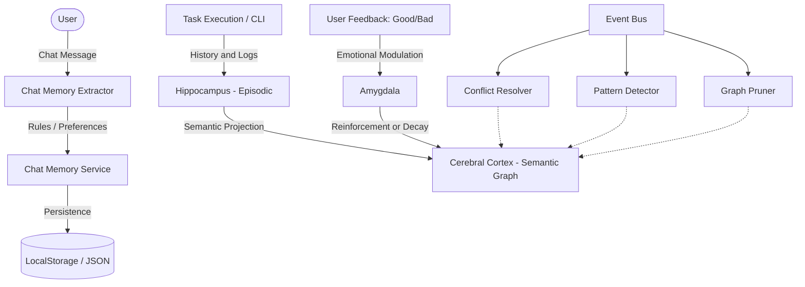

# 🤖 kaoz.1 — AI Agent with Cognitive Cortex and Tool Orchestrator (MCP)

**kaoz.1** is an **Autonomous AI Agent and Personal Cognitive Assistant**. Equipped with a persistent memory architecture inspired by the human brain structure and integration with the **Model Context Protocol (MCP)**, she is capable of executing local CLI tasks, interacting with web services, managing devices and everyday applications (like Spotify), and continuously learning based on your preferences and feedback.

---

## 🧠 Cognitive Cortex Architecture (Cognitive Memory)

**kaoz.1** has a dynamic and continuous learning system that stores, associates, and decays concepts according to daily use.



### Memory Subsystems
*   **Hippocampus (Episodic):** Records experiences at runtime. Saves the history of created tasks, generated scripts, executed prompts, and tool results in structured details.
*   **Cerebral Cortex (Semantic Graph):** Organizes knowledge into nodes and connections (entities, concepts, and relationships). Each concept has a confidence level and a relevance rate.
*   **Amygdala (Importance Modulation):** If you provide positive (`good`) or negative (`bad`) feedback about a task execution or chat response, the Amygdala adjusts the emotional weight and confidence of that information in the graph, reinforcing correct actions and forgetting mistakes.
*   **Event Bus (Conflict Resolver, Pattern Detector & Graph Pruner):**
    *   **Conflict Resolver:** Resolves logical contradictions created by changes in user preferences.
    *   **Pattern Detector:** Identifies repetitive failure patterns in avatar executions or commands.
    *   **Graph Pruner:** Performs compression and gradual decay of rarely used connections in the memory graph to optimize LLM context consumption.

---

## 💬 Continuous Preference Extraction (Chat Memory Extractor)

While using the Chat, **kaoz.1** analyzes and extracts implicit and explicit rules that you state in the conversation:
*   **Pattern Detection:** Phrases like *"don't do [X] anymore"*, *"whenever [Y], execute [Z]"*, *"I prefer to use [W]"*, or *"remember that in this project [V]"* are immediately detected, categorized (such as workflow rules, style preferences, corrections, or project facts), and saved in her long-term memory.
*   **Automated Sensitive Redaction:** An active filter intercepts API keys, passwords, security tokens, SSNs/CPFs, and financial data in messages, preventing critical data from being recorded in the Semantic Graph.

---

## 🔌 Tool Orchestration & Model Context Protocol (MCP)

The Agent uses the **Model Context Protocol (MCP)** to transform into a unified tool hub:
*   **Spotify Integration:** Direct natural language playback commands (e.g., *"play that indie song on Spotify"* or *"create a playlist called Focus"*). The agent interacts via MCP to list active devices, play, pause, manage volume, add to queue, and build playlists.
*   **Financial and Web Searches:** Integrated fast web scraping tools (`quick-web-search.ts`) and dynamic currency quotation queries (e.g., USD/BRL quote).
*   **Local CLI Execution:** Ability to generate and manage command-line subprocesses in the local operating system in a smart and monitorable way.

---

## 🎬 UGC Creation Studio (Legacy Feature)

Even with a focus on general task orchestration, the original video suite remains 100% active:
*   **Avatar Registration:** Allows registering authorized avatars with a photo, base video, and custom voice.
*   **Background Video Pipeline:**
    *   Generates a script adapted to the target platform.
    *   Synthesizes realistic voice via OmniVoice or Fish Audio.
    *   Executes lip-sync with MuseTalk 1.5.
    *   Processes and removes the expert's background with Python (`rembg`, `onnxruntime`).
    *   Assembles the final rendering in vertical format via `ffmpeg`.

---

## 🛠️ Technology Stack

*   **Frontend & API:** Next.js 16 (App Router) + React 19 + TypeScript + Tailwind CSS + Framer Motion.
*   **Agents & Orchestration:** Model Context Protocol (MCP) SDK, Playwright for browser automation in free LLMs, direct integration with Gemini and OpenAI.
*   **Voice & Audio:** Fish Audio TTS, Cartesia.js, OmniVoice (via Gradio Client).
*   **Media Processing:** Local FFMpeg/FFProbe, python-rembg (pillow and onnxruntime for background removal), `yt-dlp` for downloading reference videos.

---

## ⚙️ Configuration and Installation

### 1. Install Next.js dependencies
```bash
npm install
```

### 2. Configure the environment
Copy the `.env.example` file to `.env.local`:
```bash
copy .env.example .env.local
```

Open the `.env.local` file and configure your credentials. Main variables:
```env
# Default test Workspace ID
APP_WORKSPACE_ID=00000000-0000-4000-8000-000000000001

# AI & LLM Keys
OPENAI_API_KEY=
# Flow & Web Automation (Playwright) Settings
FLOW_HEADLESS=false # false is recommended so that ChatGPT/Claude/DeepSeek bypass Cloudflare Turnstile
FLOW_URL=https://flow.google

# Voice and Synthesis
FISH_AUDIO_API_KEY=
OMNIVOICE_API_URL=http://localhost:8000
OMNIVOICE_API_KEY=

# Lip-sync (MuseTalk)
LIPSYNC_ENGINE=musetalk-v15
LIPSYNC_API_URL=http://localhost:8010
LIPSYNC_API_KEY=

# Local paths for renderers (Optional - if not in the global PATH)
FFMPEG_PATH=
FFPROBE_PATH=
YTDLP_PATH=
REMBG_PYTHON_PATH=
```

### 3. Configure Python dependencies (optional, only for the video background remover)
```bash
python -m pip install rembg pillow onnxruntime
```

### 4. Run the development server
```bash
npm run dev
```
Open your browser at `http://localhost:3000`.

---

## 📂 Project Structure

```text
app/
  api/
    agent-llm/              Agent execution API and settings
    cortex/                 API for reading and controlling the Cognitive Cortex
    flow/chat/              Agent's interactive chat stream endpoint with MCP
    fish-audio/             Fish Audio voice synthesis API
    mcp/                    MCP tools and connections manager
  (dashboard)/
    cortex/                 Interactive real-time view of the semantic graph
    flow/                   Main command chat and interaction with the kaoz.1 agent
    avatars/                Avatar control for the UGC studio
    jobs/                   Video render status and management
components/
  cortex/                   2D/3D graphical viewer of the Cortex memory
lib/
  cognitive-memory/         Cognitive Cortex core (Hippocampus, Cortex, Amygdala)
  ai/                       Intelligence providers (Gemini, OpenAI, Cartesia)
  videos/                   Render engines, downloader, and UGC video pipeline
services/
  agent-llm/                Agent, processes, and CLI management service
  mcp/                      Management and communication with external MCP servers
  spotify/                  Response formatter and Spotify command mapping
  web-search/               Integrated online search engine
```

---

## 📝 Development and Automation Notes

1.  **Playwright Sessions (Browser):** The agent uses a persistent Chromium to simulate the browser. To log in to free chat platforms (Gemini, ChatGPT, Claude, and DeepSeek) and bypass Cloudflare challenges, go to the **Settings** page in the application and use the session management section to do the initial manual login. The cookies will be saved locally in `storage/browser-profile/`.
2.  **OneDrive and File Lock (Windows):** The UGC video pipeline implements resilient routines with up to 5 retries when accessing local files to bypass temporary lock issues caused by active OneDrive or Dropbox synchronization.
3.  **SSE Disconnections:** To ensure proper memory usage, SSE Client calls opened with microservices are explicitly terminated at the end of each request.
