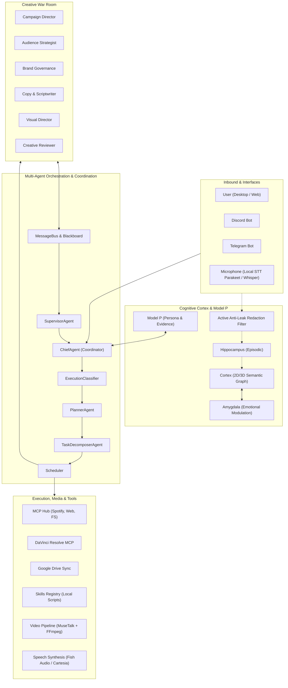

<div align="center">

# ⚡ Kaoz.1
### Autonomous Neuro-Cognitive Operating System & Multi-Agent Creative Studio

*An autonomous mind powered by persistent living memory, a swarm of specialized agents, and full control over your desktop, video production, and community.*

[](https://nextjs.org/)
[](https://react.dev/)
[](https://www.typescriptlang.org/)
[](https://www.electronjs.org/)
[](https://modelcontextprotocol.io/)
[](https://www.blackmagicdesign.com/products/davinciresolve)

[Overview](#-overview) •
[Architecture](#-system-architecture) •
[Core Pillars](#-core-pillars) •
[Navigation & Shortcuts](#-navigation--productivity) •
[Installation](#-installation--getting-started) •
[Documentation](#-technical-documentation)

---

</div>

## 🚀 Overview

**Kaoz.1** is neither a simple chatbot nor a generic API wrapper. It is a **personal neuro-cognitive operating system and autonomous creative studio**, engineered to run natively on Windows and orchestrate complex workflows with intelligence, deep memory, and real-world execution.

Inspired by biological cognitive architectures and supercharged by the **Model Context Protocol (MCP)**, Kaoz.1 brings together:

1. **Continuous Organic Memory**: a 2D/3D semantic knowledge graph that learns habits, condenses task experiences into an episodic hippocampus, and modulates relevance via an amygdala based on user feedback.
2. **Multi-Agent War Room**: a collaborative council of specialized agents (strategy, audience, brand governance, copy, visual direction, and creative review) that deliberate and forge campaigns by consensus.
3. **Model P (Personal Cognitive Engine)**: behavioral and identity modeling for the creator persona, equipped with evidence inspection, confidence scores, and an interactive tone alignment playground.
4. **Complete Audiovisual Studio**: direct **DaVinci Resolve** control via MCP, cloud asset sync with **Google Drive**, neural lip-sync (**MuseTalk 1.5**), expressive voice synthesis, and professional timeline editing shortcuts (J-K-L).
5. **Extensible Skills Ecosystem**: modular skills powered by `SKILL.md` definitions and autonomous executable scripts with governance and UI management.
6. **Omnichannel Connectors**: bidirectional native bots for **Discord**, **Telegram**, and **Bluesky** with an encrypted local credential vault.
7. **Privacy & Zero API Cost**: offline local speech-to-text via **Parakeet** (PT-BR) and **Whisper.cpp**, delivering zero-latency transcription without third-party API dependencies.

---

## 🏛️ System Architecture

Kaoz.1 operates as a decoupled, coordinated multi-agent pipeline where no monolithic executor bottlenecks system execution:


```mermaid
flowchart TB
    subgraph Inbound["Inbound & Interfaces"]
        U["User (Desktop / Web)"]
        DC["Discord Bot"]
        TG["Telegram Bot"]
        MIC["Microphone (Local STT Parakeet / Whisper)"]
    end

    subgraph Core["Multi-Agent Orchestration & Coordination"]
        CH["ChiefAgent (Coordinator)"]
        EC["ExecutionClassifier"]
        PL["PlannerAgent"]
        TD["TaskDecomposerAgent"]
        SC["Scheduler"]
        MB["MessageBus & Blackboard"]
        SV["SupervisorAgent"]
    end

    subgraph CreativeDomain["Creative War Room"]
        DIR["Campaign Director"]
        AUD["Audience Strategist"]
        BRD["Brand Governance"]
        CPY["Copy & Scriptwriter"]
        VIS["Visual Director"]
        REV["Creative Reviewer"]
    end

    subgraph Memory["Cognitive Cortex & Model P"]
        HIP["Hippocampus (Episodic)"]
        CTX["Cortex (2D/3D Semantic Graph)"]
        AMG["Amygdala (Emotional Modulation)"]
        MDP["Model P (Persona & Evidence)"]
        RED["Active Anti-Leak Redaction Filter"]
    end

    subgraph Tooling["Execution, Media & Tools"]
        MCP["MCP Hub (Spotify, Web, FS)"]
        DVR["DaVinci Resolve MCP"]
        GDR["Google Drive Sync"]
        SKL["Skills Registry (Local Scripts)"]
        VID["Video Pipeline (MuseTalk + FFmpeg)"]
        TTS["Speech Synthesis (Fish Audio / Cartesia)"]
    end

    Inbound --> CH
    CH --> EC
    EC --> PL
    PL --> TD
    TD --> SC
    SC --> CreativeDomain
    CreativeDomain <--> MB
    SC --> Tooling
    MB --> SV
    SV --> CH

    Inbound -.-> RED
    RED -.-> HIP
    HIP -.-> CTX
    CTX <--> AMG
    MDP <--> CH
```

---

## ⚡ Core Pillars

### 🧠 1. Cognitive Cortex (Living Persistent Memory)
Kaoz.1 doesn't forget who you are when the session ends. It continuously organizes knowledge across dedicated neuro-subsystems:
* **Hippocampus (Episodic Memory):** Logs every executed task, terminal command, generated script, and tool output in structured detail.
* **Cerebral Cortex (2D/3D Semantic Graph):** Transforms facts and interactions into an interactive relational graph accessible in `/cortex`. Nodes and edges represent entities, preferences, decisions, and constraints.
* **Amygdala (Relevance Modulation & Feedback):** Dynamically adjusts neural weights based on feedback (`good` / `bad`). Winning strategies get reinforced; sub-optimal paths decay naturally over time.
* **Conflict Resolver & Graph Pruner:** Resolves logical contradictions when your preferences evolve and compresses stale edges to keep LLM context consumption ultra-lean.
* **Active Sensitive Redaction:** Real-time filter that intercepts API tokens, passwords, financial records, and personal IDs before any node is saved to memory.

---

### 🧬 2. Model P (Personal Cognitive Engine & Personas)
Your style, your boundaries, your voice. **Model P** is dedicated to maintaining flawless brand and persona fidelity:
* **Persona Profiles (e.g., Lorenzo Ancestral):** Configures vocal tone (bold, provocative, empathetic, analytical), characteristic catchphrases, core beliefs, target audiences, and strict ethical guardrails.
* **Confidence Scoring & Evidence Inspection:** Every learned item carries a confidence score (High, Medium, Low) and an audit trail—allowing you to inspect the exact prompt or conversation that produced the rule.
* **Persona Playground:** An interactive sandbox in `/model-p` where you can pressure-test prompts, simulate responses, and calibrate persona traits before production runs.

---

### ⚔️ 3. Multi-Agent War Room & Creative Supervision
High-impact creative production isn't a one-shot prompt task. Kaoz.1 summons a council of specialized agents collaborating within the **CreativeDomain**:
* 👑 **Campaign Director (`campaign-director`):** Shapes overarching campaign strategy, milestones, and high-level positioning.
* 🎯 **Audience Strategist (`audience-strategist`):** Pinpoints audience segments, pain points, desires, and psychological hooks.
* 🛡️ **Brand Governance (`brand-governance`):** Audits content against creator guidelines, voice consistency, and compliance.
* ✍️ **Copy & Scriptwriter (`copywriter`):** Drafts compelling hooks, high-retention video scripts, and call-to-actions.
* 🎨 **Visual Director (`visual-director`):** Orchestrates aesthetics, framing suggestions, pacing, and visual transitions.
* 🔍 **Creative Reviewer (`creative-reviewer`):** Reviews outputs, drives multi-agent consensus (*"Consensus reached"*), or flags required revisions.

Watch the real-time debate, decision trees, and generated artifacts unfold inside the **Supervision** interface (`/supervision`).

---

### 🎬 4. Audiovisual Studio & DaVinci Resolve MCP
A creator-grade video workstation combining automated AI pipelines with tactile manual control:
* **Native DaVinci Resolve Integration:** Direct command of DaVinci Resolve via MCP (automated project setup, timeline assembly, clip insertion, and render queues).
* **Google Drive Asset Sync:** Seamless batch discovery, download, and sync of b-rolls, media bins, and raw footage directly from cloud drives.
* **Pro Timeline Controls:** Integrated player featuring classic shuttle shortcuts (`J` reverse shuttle, `K` pause, `L` forward shuttle, `Space`, frame nudging, and marker jumping).
* **Neural Lip-Sync Pipeline:** Hyper-realistic voice synthesis paired with **MuseTalk 1.5** facial lip-sync, AI background extraction (`rembg` + ONNX), and vertical FFmpeg assembly built to handle file locks on OneDrive/Dropbox.

---

### 🧩 5. Extensible Skills Ecosystem
Kaoz.1 is built to grow. Add new capabilities using its open folder-based skill architecture:
* Each skill lives in `skills/<skill-name>/` with:
  * `SKILL.md`: Frontmatter YAML metadata (name, description, required capabilities, tools) followed by agent instructions.
  * `scripts/`: Executable implementations in TypeScript, JavaScript, or Python.
* **Built-in Skills:**
  * `davinci.resolve`: DaVinci Resolve Studio & Free scripting automation.
  * `analisador-de-metricas`: In-depth retention analysis and social engagement metrics.
  * `gerador-de-hashtags`: Algorithmic viral hashtag clustering by niche.
  * `criador-de-legendas-virais`: High-conversion captions with magnetic hooks and CTAs.
  * `criador-de-logos` & `logo-grid-preview`: Visual concept generation and brand grid previews.
  * `pdf-document-builder`: Structured PDF generation and report compilation.
  * `trend-hunter` & `research.web-research`: Deep web mining for viral references and news.
* **Visual Management:** Inspect, toggle, configure, and generate new skills straight from the **Skills** tab in `/settings`.

---

### 📡 6. Native Omnichannel Connectors (Discord, Telegram & Bluesky)
Deploy your agent directly to your active communities:
* **Discord Inbound & Gateway:** Native WebSocket gateway, slash commands, threaded conversational replies, and formatted embeds.
* **Telegram Polling & Media:** Continuous long-polling engine supporting audio transcription, photo processing, and rich command execution without public webhooks.
* **Encrypted ConnectorVault:** Encrypted local credential storage ensures bot tokens and keys remain locked to your machine.

---

### 🎙️ 7. Expressive Audio & Offline Local Speech
* **Parakeet Local STT (PT-BR):** High-precision offline speech-to-text specifically tuned for Brazilian Portuguese. A ~670 MB model downloaded on demand and executed locally on CPU/GPU—**zero API subscription costs and total privacy**.
* **Whisper.cpp Runtime:** Ultra-fast, lightweight C++ transcription runtime for rapid voice processing.
* **Expressive Vocal Synthesis:** Native support for **Fish Audio**, **Cartesia**, and **OmniVoice** with nuanced inflection and cadence control.

---

## 🗺️ Navigation & Productivity

### Application Routes

| Route | Module | Purpose |
| :--- | :--- | :--- |
| `/flow` | **Kaoz.1 (Flow)** | Main interactive chat with Live Canvas, terminal execution, and artifact preview. |
| `/supervision` | **Supervisor** | Multi-agent War Room, creative campaign deliberation, and process tracking. |
| `/cortex` | **Cognitive Cortex** | Interactive 2D/3D semantic knowledge graph, episodic memory, and chat logs. |
| `/model-p` | **Model P** | Creator persona dashboard, evidence inspector, confidence scores, and sandbox. |
| `/video` | **Video Studio** | Audiovisual workstation, DaVinci Resolve integration, Google Drive sync, and lip-sync. |
| `/settings` | **Settings** | LLM providers, MCP servers, Skills management, community bots, and web sessions. |

### Essential Keyboard Shortcuts

| Shortcut | Action |
| :--- | :--- |
| `Alt + 1` | Navigate to **Kaoz.1 (Flow)** |
| `Alt + 2` | Navigate to **Supervisor (War Room)** |
| `Alt + 3` | Navigate to **Cognitive Cortex** |
| `Alt + 4` | Navigate to **Video Studio** |
| `Alt + 5` | Navigate to **Settings** |
| `Alt + 6` | Navigate to **Model P** |
| `Ctrl + K` / `Cmd + K` | Open global **Command Palette** |
| `Ctrl + B` / `Cmd + B` | Toggle sidebar collapse |
| `?` | Show quick keyboard shortcuts cheatsheet |
| `J` / `K` / `L` | *(In Video View)* Shuttle Reverse / Pause / Shuttle Forward |
| `Space` | *(In Video View)* Play / Pause |

---

## ⚙️ Installation & Getting Started

### Prerequisites
* **Node.js**: v20+ or v22 LTS
* **Python** (optional, for local background removal and ML pipelines): v3.10+
* **FFmpeg / FFprobe**: in system PATH (or configured in `.env.local`)
* **DaVinci Resolve Studio or Free** (optional, for timeline automation)

---

### Development Mode (Web)

```powershell
# 1. Install dependencies
npm install

# 2. Setup environment configuration
copy .env.example .env.local

# 3. Start local development server
npm run dev
```
Open `http://localhost:3000` in your browser.

---

### Windows Native Desktop App (Electron)

To launch the desktop environment with full OS integrations:

```powershell
# Run desktop in dev mode
npm run desktop:dev
```

To build the standalone Windows installer:

```powershell
npm run desktop:build
```

The installer will be generated at `release/Kaoz.1-Setup-<version>.exe`. The standalone package embeds the compiled Next.js server—the target machine does not need Node.js installed.

---

### 🔑 Environment Variables (`.env.local`)

Copy `.env.example` to `.env.local` and configure your API credentials:

```env
# Default Workspace
APP_WORKSPACE_ID=00000000-0000-4000-8000-000000000001

# AI Intelligence Providers
OPENAI_API_KEY=your_openai_key
GEMINI_API_KEY=your_gemini_key

# Web Automation & Login (Playwright)
FLOW_HEADLESS=false # Keep false to manually pass Cloudflare verification on first run

# Voice & Lip-sync
FISH_AUDIO_API_KEY=your_fish_audio_key
LIPSYNC_ENGINE=musetalk-v15
LIPSYNC_API_URL=http://localhost:8010

# Optional Local Binary Paths
FFMPEG_PATH=
FFPROBE_PATH=
YTDLP_PATH=

# Connectors (optional, also configurable via UI)
DISCORD_BOT_TOKEN=
TELEGRAM_BOT_TOKEN=
```

---

## 📚 Technical Documentation

Explore the internal engineering architecture inside [`docs/`](./docs/):
* [`docs/MULTIAGENT_ARCHITECTURE.md`](./docs/MULTIAGENT_ARCHITECTURE.md) — Coordination protocol between ChiefAgent, Planner, Scheduler, and Supervisor.
* [`docs/CREATIVE_DOMAIN.md`](./docs/CREATIVE_DOMAIN.md) — Multi-agent War Room dynamics, contracts, and creative pipelines.
* [`docs/WORKFLOW_FACTORY.md`](./docs/WORKFLOW_FACTORY.md) — Execution pipeline factory and state machine contracts.
* [`docs/EXECUTION_CLASSIFIER.md`](./docs/EXECUTION_CLASSIFIER.md) — Deterministic user intent classification.
* [`docs/lipsync-musetalk.md`](./docs/lipsync-musetalk.md) — Neural lip-sync engine setup and benchmarks.

---

<div align="center">

Built for performance, data privacy, creative autonomy, and neuro-cognitive intelligence.

**Kaoz.1 — The Creative Swarm OS**

</div>
