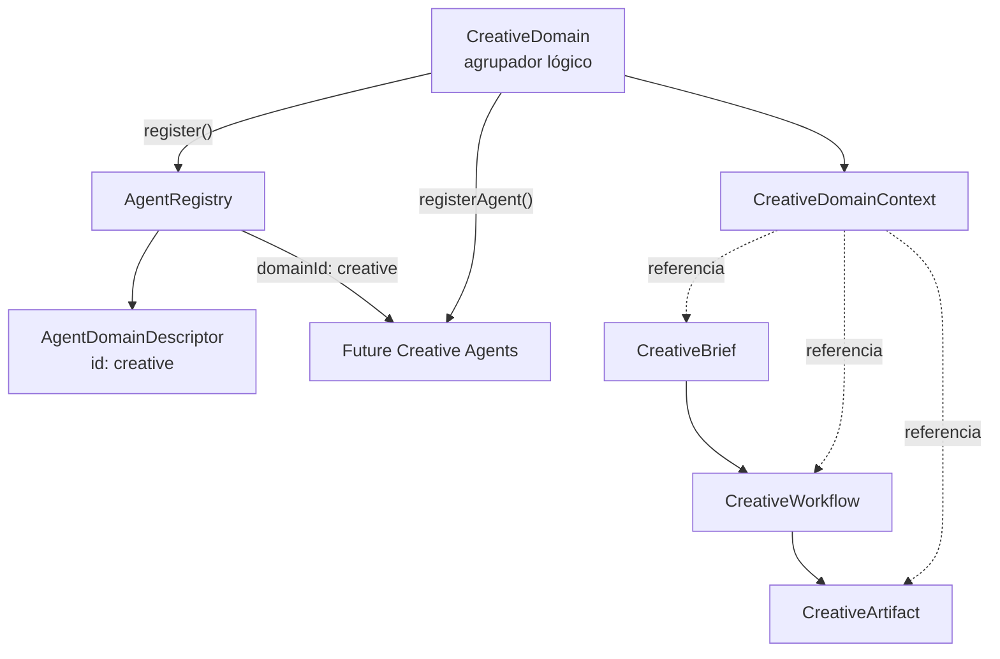
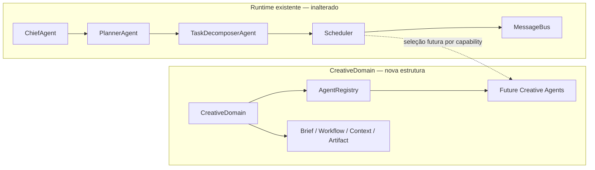

# CreativeDomain

## Objetivo

`CreativeDomain` é o limite lógico para agentes, contextos e contratos
criativos. Ele não é um agente, não executa workflows e não gera artefatos.

O domínio é registrado separadamente no `AgentRegistry`. Agentes criativos
futuros devem ser registrados por `CreativeDomain.registerAgent()`, que inclui
automaticamente o `domainId` `creative`.

## Arquitetura



## Relação com o runtime multiagente



O vínculo pontilhado representa uma extensão futura. Esta etapa não conecta
o domínio ao Chief, Planner, Scheduler ou MessageBus.

## Componentes

### CreativeDomain

- identificação canônica `creative`;
- metadata imutável do domínio;
- registro no `AgentRegistry`;
- registro de agentes com filiação obrigatória;
- criação de `CreativeDomainContext`;
- nenhuma lógica de geração.

### CreativeDomainContext

Contexto imutável específico do domínio. Pode referenciar execução, projeto,
brief, workflow e artefatos por identificador. Possui versão e timestamps, mas
não substitui nem altera o `SharedContext`.

### CreativeBrief

Contrato imutável para objetivo, audiência, entregáveis, restrições e metadata
de uma iniciativa criativa.

### CreativeWorkflow

Descrição estrutural de estágios, capabilities necessárias, dependências e
tipos esperados de artefato. Não possui `execute`, `dispatch` ou `generate`.

### CreativeArtifact

Descriptor imutável de um resultado criativo planejado, em rascunho, pronto
ou arquivado. Não contém mecanismo de geração.

## AgentRegistry

O Registry agora suporta:

- `registerDomain()`;
- `removeDomain()`;
- `getDomainById()`;
- `listDomains()`;
- `findByDomain()`;
- `AgentRegistration.domainId`;
- estatísticas `domains` e `byDomain`.

Um agente não pode ser registrado em um domínio inexistente. Um domínio não
pode ser removido enquanto possuir agentes registrados.

## Exemplo de registro futuro

```ts
const registry = new AgentRegistry();
const creativeDomain = new CreativeDomain();

creativeDomain.register(registry);
creativeDomain.registerAgent(registry, {
  agent: futureCreativeAgent,
  type: "creative-layout",
});
```

## Limites desta etapa

Não foram adicionados:

- geração de imagem, vídeo, texto ou layout;
- execução de `CreativeWorkflow`;
- comunicação com outros agentes;
- integração com Chief, Planner, Scheduler ou MessageBus;
- persistência;
- rotas ou interface.

Também não foram alterados `SharedContext` e `Blackboard`.
