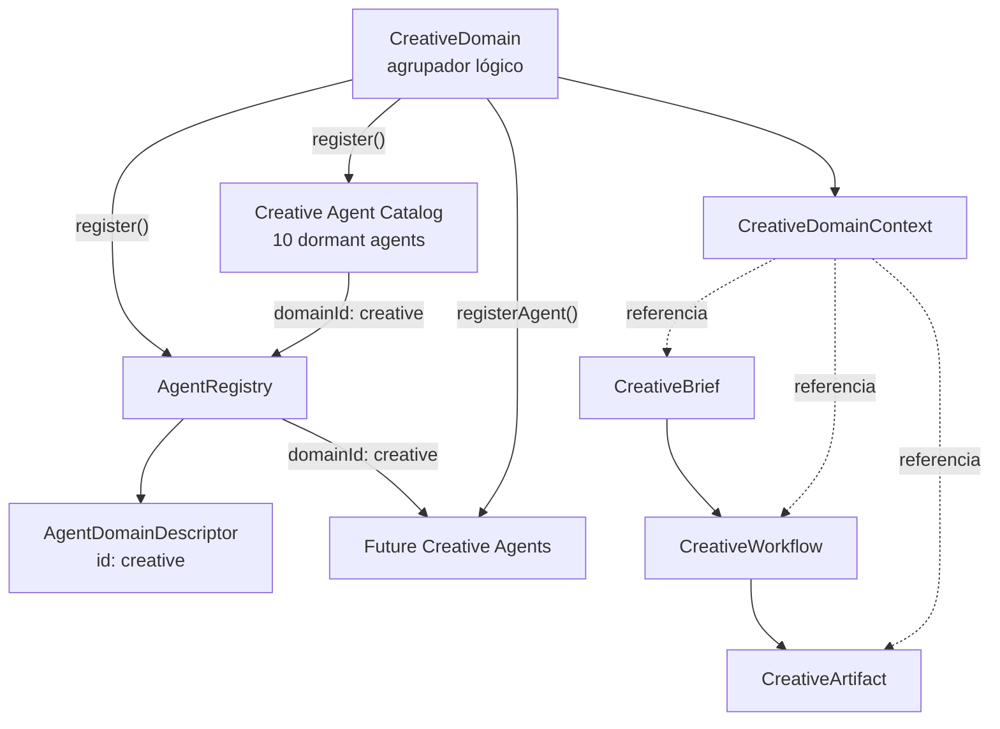
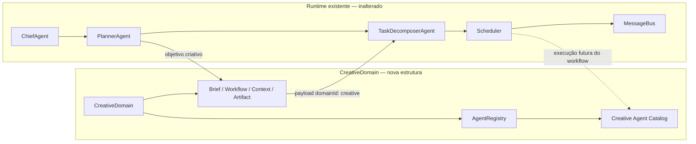
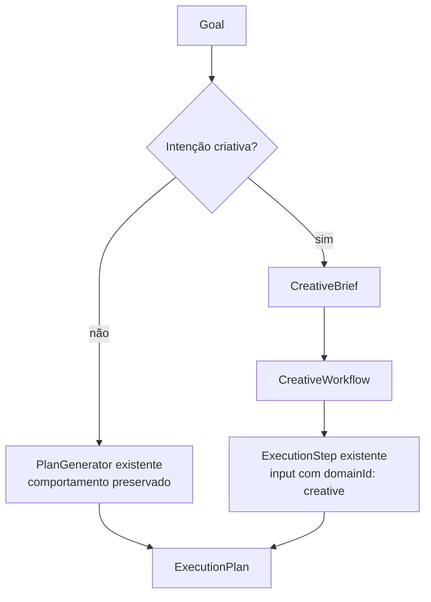
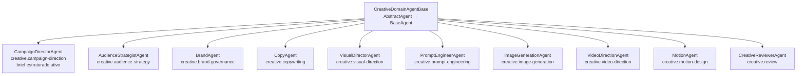
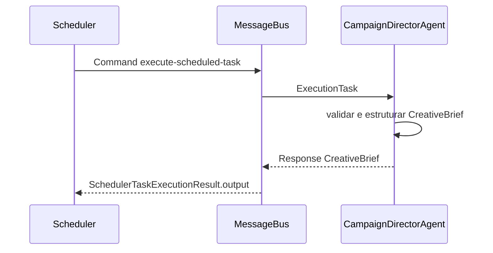

# CreativeDomain

## Objetivo

`CreativeDomain` é o limite lógico para agentes, contextos e contratos
criativos. Ele não é um agente, não executa workflows e não gera artefatos.

O domínio é registrado separadamente no `AgentRegistry`.
`CreativeDomain.register()` registra também o catálogo estrutural dos dez
agentes especializados. Agentes criativos adicionais devem ser registrados
por `CreativeDomain.registerAgent()`, que inclui automaticamente o `domainId`
`creative`.

## Arquitetura



## Relação com o runtime multiagente



O `PlannerAgent` agora reconhece intenção criativa de forma determinística.
Ele cria um `CreativeBrief` e um `CreativeWorkflow` somente para objetivos
criativos. O Chief, o Scheduler, o MessageBus, o SharedContext, o Blackboard e
os demais domínios permanecem inalterados.

## Roteamento do Planner



São reconhecidos `campanha`, `imagem`, `vídeo`, `branding`, `publicidade`,
`social media`, `anúncio` e `marketing`, incluindo plurais aplicáveis e
variações com ou sem acento. A classificação considera apenas título e
objetivo. Restrições não participam da decisão, pois podem mencionar um ativo
somente para proibi-lo.

| Intenção | Capability requerida pelo CreativeWorkflow |
|---|---|
| campanha, publicidade, social media, anúncio, marketing | `creative.campaign-direction` |
| imagem | `creative.image-generation` |
| vídeo | `creative.video-direction` |
| branding | `creative.brand-governance` |

## Catálogo de agentes



Todos registram:

- metadata, identificador e tipo próprios;
- versão `1.0.0`;
- uma capability especializada;
- `domainId` `creative` e domínio legível `Creative`;
- health e heartbeat herdados de `AbstractAgent`;
- restrição `not-executable` para os especialistas ainda estruturais.

O `CampaignDirectorAgent` é a primeira exceção ativa: ele recebe intenção de
campanha já estruturada e produz um `CreativeBrief`, sem IA, prompts,
ferramentas ou geração de mídia. Os outros nove agentes continuam estruturais;
seus `handleTask()` e `handleMessage()` rejeitam execução com
`CreativeAgentNotExecutableError`.

### Comunicação do CampaignDirector



O agente não conhece uma instância do Scheduler. A resposta correlacionada do
MessageBus é capturada pelo fluxo normal do Scheduler.

## Componentes

### CreativeDomain

- identificação canônica `creative`;
- metadata imutável do domínio;
- registro no `AgentRegistry`;
- registro de agentes com filiação obrigatória;
- criação de `CreativeDomainContext`;
- nenhuma lógica de geração.

### CreativeDomainContext

Contexto imutável específico do domínio. Pode referenciar execução, projeto,
brief, workflow e artefatos por identificador. Possui versão e timestamps, mas
não substitui nem altera o `SharedContext`.

### CreativeBrief

Contrato imutável para objetivo, público-alvo, canais, identidade visual, tom,
mensagem principal, restrições, entregáveis, cronograma, KPIs e metadata de uma
iniciativa criativa.

### CreativeWorkflow

Descrição estrutural de estágios, capabilities necessárias, dependências e
tipos esperados de artefato. Não possui `execute`, `dispatch` ou `generate`.

### CreativeArtifact

Descriptor imutável de um resultado criativo planejado, em rascunho, pronto
ou arquivado. Não contém mecanismo de geração.

## AgentRegistry

O Registry agora suporta:

- `registerDomain()`;
- `removeDomain()`;
- `getDomainById()`;
- `listDomains()`;
- `findByDomain()`;
- `AgentRegistration.domainId`;
- estatísticas `domains` e `byDomain`.

Um agente não pode ser registrado em um domínio inexistente. Um domínio não
pode ser removido enquanto possuir agentes registrados.

## Exemplo de registro futuro

```ts
const registry = new AgentRegistry();
const creativeDomain = new CreativeDomain();

creativeDomain.register(registry); // registra domínio + catálogo
creativeDomain.registerAgent(registry, {
  agent: futureCreativeAgent,
  type: "creative-layout",
});
```

## Limites atuais

Não foram adicionados:

- geração de imagem, vídeo, texto publicitário ou layout;
- execução de `CreativeWorkflow`;
- comunicação com outros agentes;
- persistência;
- rotas ou interface.

O Planner apenas materializa e marca a estrutura para o domínio. As etapas e
capabilities produzidas pelo `PlanGenerator` existente são preservadas. Apenas
o `CampaignDirectorAgent` está habilitado para produzir briefs quando receber
uma tarefa `creative.campaign-direction`; os demais agentes criativos continuam
inativos. Não foram alterados Chief, Scheduler, MessageBus, SharedContext,
Blackboard nem outros domínios.
