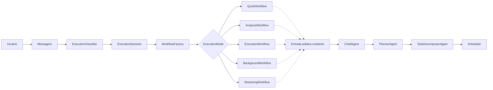
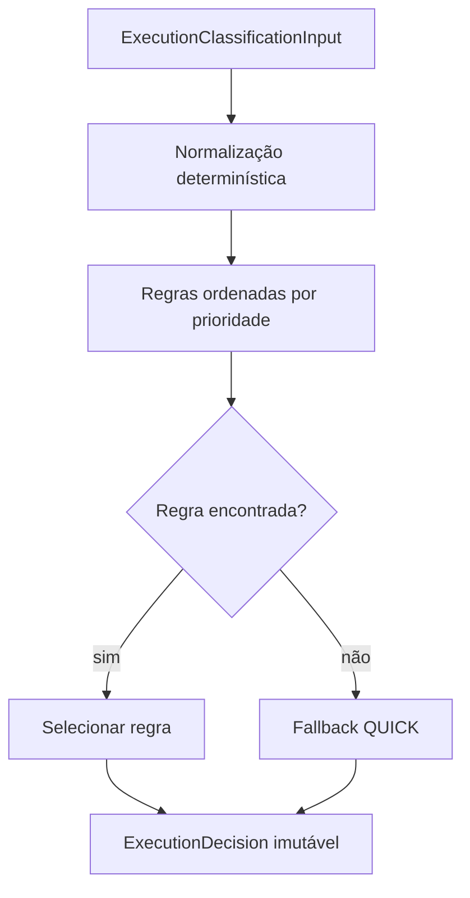

# ExecutionClassifier

## Responsabilidade

`ExecutionClassifier` é a fronteira de pré-execução que determina somente o
modo adequado para uma mensagem. Ele não responde ao usuário, não executa
ferramentas, não chama agentes e não inicia workflows.

O `ChiefAgent` agora classifica cada objetivo recebido. Decisões `EXECUTION`
criam uma `ExecutionSession` e entram obrigatoriamente no
`ExecutionWorkflow`. A camada continua sem alteração direta de rotas ou do
`chatWithAgent()`.

## Posição arquitetural

O classificador é a primeira decisão interna do `ChiefAgent` e produz apenas a
decisão de execução. No modo `EXECUTION`, a resposta fica bloqueada até o
workflow terminar.

## Contratos

### ExecutionMode

- `QUICK`: caminho curto, sem sinais de análise extensa ou execução gerenciada;
- `ANALYSIS`: investigação, comparação, diagnóstico ou raciocínio deliberado;
- `EXECUTION`: criação, alteração ou outra ação gerenciada;
- `BACKGROUND`: trabalho diferido, recorrente ou monitorado;
- `STREAMING`: saída progressiva ou em tempo real.

### ExecutionDecision

Toda decisão imutável contém:

- `mode`;
- `confidence`, entre 0 e 1;
- `reason`, com código, descrição, sinais e regra da política;
- `estimatedComplexity`, entre 0 e 100;
- `estimatedCost`, não negativo e sem unidade imposta;
- `estimatedDuration`, em milissegundos;
- `requiredDomains`;
- `requiredCapabilities`;
- `expectedWorkflow`.

### ExecutionPolicy

Uma política é declarativa, versionada e imutável. Regras possuem prioridade,
sinais textuais, modo, razão, estimativas e requisitos. O
`PolicyBasedExecutionClassifier` depende apenas dessa interface; políticas
alternativas podem ser fornecidas sem alterar o classificador.

## Fluxo interno

Não há dependência de modelo, provider, ferramenta, MessageBus, Scheduler,
agente especializado ou domínio.
