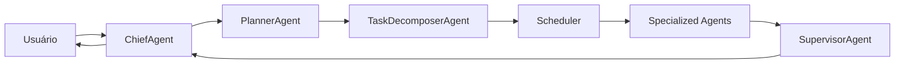
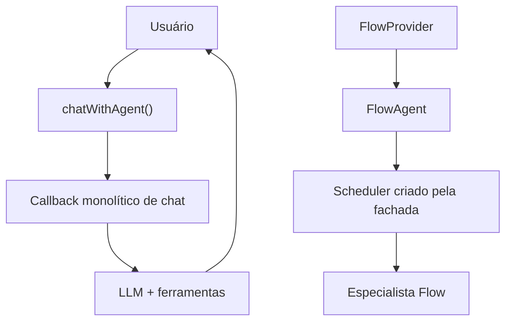
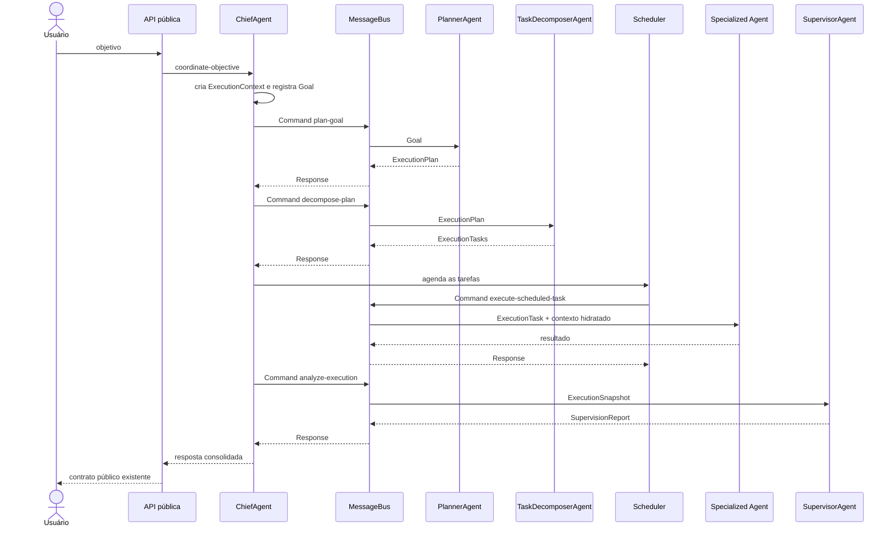
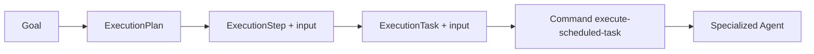
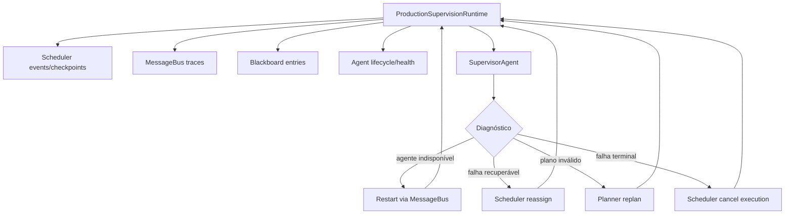

# Arquitetura Multiagente do Kaoz.1

## Estado final

O runtime de conversação e os fluxos do Google Flow usam uma única cadeia de
coordenação:



`chatWithAgent()` e `FlowAgent` continuam sendo pontos públicos compatíveis,
mas nenhum deles executa trabalho. Ambos criam uma solicitação para o
`ChiefAgent`, que coordena o pipeline e consolida o resultado.

## Invariantes

1. O `ChiefAgent` coordena; não executa tarefas.
2. O `PlannerAgent` é a única entrada para materializar um `ExecutionPlan`.
3. O `TaskDecomposerAgent` é a única entrada para produzir `ExecutionTask`.
4. O `Scheduler` é o único componente que ordena e despacha execução.
5. Uma tarefa só é executada por um agente que declare sua capability.
6. Não existe fallback para executor ou planejador monolítico.
7. A comunicação entre o coordenador, os agentes de infraestrutura e os
   agentes de execução passa pelo `MessageBus`.
8. O `SupervisorAgent` observa o plano, o Scheduler, os agentes, o
   `MessageBus` e o `Blackboard` antes de o Chief devolver a resposta.
9. Contextos e planos são imutáveis; uma alteração produz uma nova versão.
10. O contrato público de `chatWithAgent()` e da fachada `FlowAgent` é
    preservado.

## Antes e depois

### Antes



O Chief ainda podia fabricar um `LegacyAgentAdapter`, o Planner podia cair em
um plano legado e o `FlowAgent` criava o Scheduler diretamente.

### Depois



## Componentes do runtime

| Camada | Responsabilidade |
| --- | --- |
| `ChiefAgent` | Criar contexto e Goal, solicitar plano e decomposição, acionar Scheduler, solicitar supervisão e consolidar a resposta. |
| `PlannerAgent` | Converter um `Goal` em `ExecutionPlan` estruturado e independente do provedor de IA. |
| `TaskDecomposerAgent` | Converter passos do plano em tarefas imutáveis, preservando capability, dependências, prioridade, timeout, saída esperada e input. |
| `Scheduler` | Seleção por capability, dependências, concorrência, fairness, load balancing, retry, timeout, cancelamento e eventos. |
| `MessageBus` | Commands, Responses, Events, Broadcasts, prioridade, correlation id, retry, timeout, dead letter e tracing em memória. |
| `SupervisorAgent` | Detectar falhas, deadlock, loop, timeout, duplicação, retry infinito, agente inativo e tarefa presa; propor e aplicar recuperação. |
| `ProductionSupervisionRuntime` | Construir snapshots, acompanhar as fontes e aplicar reatribuição, restart, cancelamento e replanejamento. |
| `AgentRegistry` | Registro, discovery, seleção por capability/tipo/estado, heartbeat, health e estatísticas. |
| `SharedContext` | Contexto ativo imutável, versionado, com merge, snapshot e rollback. |
| `Blackboard` | Publicação e consumo de conhecimento versionado por prioridade e confiança. |
| `MemoryService` | Fronteira para leitura/persistência de memória e publicação no Blackboard. |
| `ToolExecutionService` | Fronteira auditável para permissões, custo, consumo, duração e erros de ferramentas. |

## Domínios especializados

O `CreativeDomain` agrupa agentes e contratos criativos sem executar geração.
Ele é registrado como domínio no `AgentRegistry` e reúne os contratos
`CreativeDomainContext`, `CreativeBrief`, `CreativeWorkflow` e
`CreativeArtifact`. O Planner reconhece objetivos criativos por regras
determinísticas, materializa o brief/workflow e produz uma etapa com
`domainId: creative` e capability `creative.*`. Objetivos não criativos
continuam no gerador de planos existente.

Seu catálogo estrutural registra `CampaignDirectorAgent`,
`AudienceStrategistAgent`, `BrandAgent`, `CopyAgent`,
`VisualDirectorAgent`, `PromptEngineerAgent`, `ImageGenerationAgent`,
`VideoDirectionAgent`, `MotionAgent` e `CreativeReviewerAgent`. Todos
implementam o contrato `BaseAgent` por meio de `AbstractAgent`, mas permanecem
sem execução nesta etapa.

A especificação e os diagramas estão em
[`CREATIVE_DOMAIN.md`](./CREATIVE_DOMAIN.md).

## Agentes especializados

### Conversação

- `ChatAnalysisAgent`: executa o estágio de análise.
- `ChatResearchAgent`: executa o estágio de preparação de pesquisa.
- `ChatMediaPlanningAgent`: executa o estágio de preparação da ação de mídia.
- `ChatResponseAgent`: é o único agente que produz o `ChatAgentResponse`.

`chatWithAgent()` somente monta o objetivo, as dependências do runtime e os
agentes especializados, chama o Chief e devolve `result.response`.

### Google Flow

- `ImageAgent`: geração de imagens.
- `VideoAgent`: geração de vídeo.
- `CreativeAgent`: criativos e planejamento específico do Flow.
- `RefineAgent`: refinamento de uma execução existente.
- `ProjectAgent`: projeto completo.

`FlowAgent` é uma fachada de compatibilidade. Os métodos
`createCompleteProject()`, `runAutonomousAgent()` e
`planAutonomousAgent()` criam objetivos coordenados pelo Chief. A fachada não
instancia nem chama o Scheduler.

## Planejamento e payload da tarefa

O `ExecutionStep` aceita um `input` imutável e independente do modelo. A
materialização do plano congela recursivamente esse valor. O decompositor o
propaga para `ExecutionTask.input`. Isso permite que a infraestrutura carregue
um payload específico do domínio sem ensinar o decompositor ou o Scheduler
sobre Google Flow, chat ou estruturas internas do `CreativeWorkflow`.



## Mensageria e tracing

O endereço de execução padrão é `agent.scheduler.execute-task`, com mensagem:

```text
{
  type: "execute-scheduled-task",
  task: ExecutionTask
}
```

O `AgentMessageEndpoint` é a única fronteira que guarda a referência concreta
de um agente. O Scheduler conhece candidatos para seleção, mas entrega o
trabalho pelo `AgentMessageGateway`. Cada envelope registra remetente,
destinatário, correlation id, payload, duração, latência, resultado, falha e
timeout. Falhas definitivas entram na dead-letter queue em memória.

## Contexto, memória e conhecimento

Para cada objetivo, o Chief cria:

- `ExecutionContext`;
- `SharedContext`;
- `Blackboard`;
- `MemorySnapshot`, via `AgentContextAdapter` e `MemoryService`.

O Scheduler hidrata o contexto de cada tarefa antes de criar o Command. O
endpoint entrega esse contexto ao agente especializado. Os adapters
`AgentContextAdapter` e `MemoryManagerAdapter` permanecem porque são fronteiras
ativas para a memória instalada; agentes não recebem `MemoryManager`.

## Supervisão e recuperação



O dashboard interno em `/supervision` expõe snapshots, relatórios, detecções e
ações mantidos pelo `SupervisionDashboardStore`.

## Lifecycle

Planner, decompositor e supervisor possuem endpoints do MessageBus gerenciados
pelo runtime de mensageria do Chief. Agentes especializados possuem endpoints
gerenciados pelo runtime de supervisão. Em testes isolados, o Scheduler cria
endpoints temporários no seu barramento em memória. Inicialização, pausa,
retomada, heartbeat, health, restart e shutdown continuam definidos por
`BaseAgent`/`AbstractAgent`.

## Falhas

- Falha do Planner: encerra a coordenação; não existe plano legado.
- Capability ausente: o Chief rejeita antes da execução.
- Timeout: o Scheduler e o MessageBus registram o timeout.
- Falha transitória: retry limitado pela política do Scheduler.
- Falha definitiva: evento terminal, dead letter quando aplicável e
  observação do Supervisor.
- Cancelamento: aborta a execução, registra eventos e impede novas tarefas.

## Como adicionar um agente

1. Herdar de `AbstractAgent`.
2. Declarar metadata e capabilities únicas.
3. Implementar `handleTask()` sem conhecer outros agentes.
4. Aceitar `SchedulerAgentMessage` em `handleMessage()`.
5. Solicitar colaboração por Command/Event no MessageBus.
6. Usar `MemoryService` e `ToolExecutionService` nas fronteiras
   correspondentes.
7. Registrar o agente no `AgentRegistry`.
8. Adicionar testes de lifecycle, capability, mensagem e falha.

## Validação arquitetural

O teste `multiagent-final-migration.test.mjs` impede a volta de:

- `LegacyAgentAdapter`;
- `legacyPlanningAdapter`;
- fallback de planejamento legado;
- `chatWithAgent()` executando o workflow de resposta;
- `FlowAgent` instanciando ou chamando o Scheduler.

Os testes do Chief também comprovam que uma falha do Planner não executa
nenhum especialista e que toda capability planejada exige um agente nativo.
