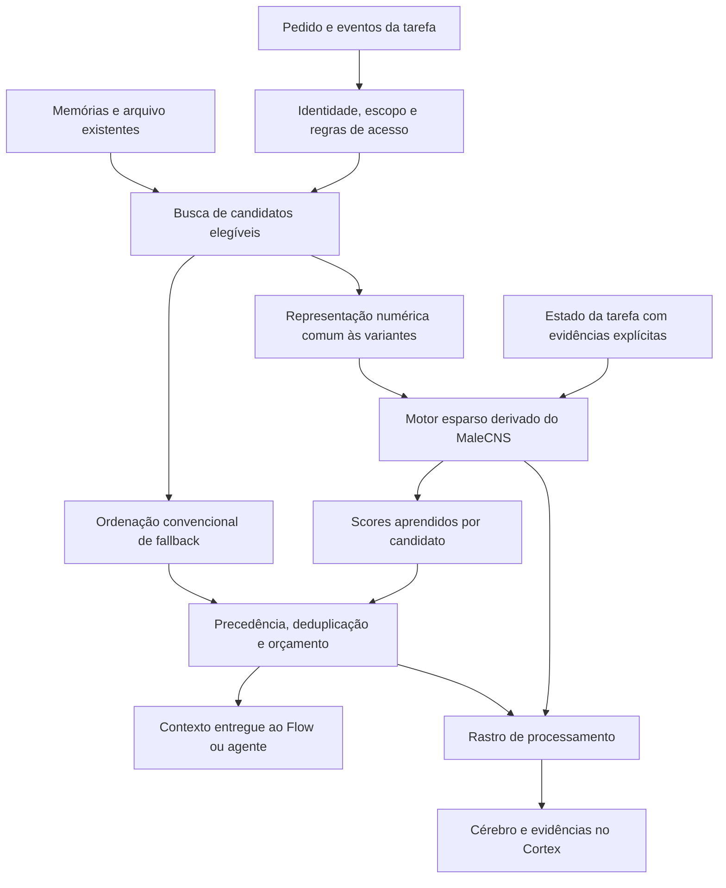

# Plano de implementação — Cortex com MaleCNS na Kaoz.1

Data: 11/09/2026. Repositório de referência: `D:\apps\mrchicken`.
Base inspecionada: `fc33afd674e07f46e59343c8c0d3793d6c6a638f`, versão `0.2.48`.
Destinatário: agente externo responsável pela implementação e validação.
Status: plano de desenvolvimento; nenhum ganho de desempenho foi medido ainda.

## 1. Missão e resultado esperado

Evoluir o Cortex da Kaoz para usar uma rede computacional derivada de conexões reais do MaleCNS v1.0 na recuperação de memória e no acompanhamento do contexto de tarefas. Integrar essa rede ao Flow e aos agentes, com uma visualização anatômica ligada aos eventos reais de processamento.

O objetivo do usuário é melhorar o próprio produto: lembrar decisões relevantes, acompanhar correções e encaminhar contexto com menos ruído. A imagem do cérebro deve tornar esse funcionamento observável. Uma tela com neurônios animados, sem participação na seleção de memória, não atende ao pedido.

Entregar uma implementação funcional de ponta a ponta, incluindo preparação reproduzível do conectoma, treinamento, inferência local, integração, interface, testes e avaliação comparativa. A promoção do motor a padrão depende dos critérios de qualidade deste documento. Se a hipótese não se confirmar, entregar o recurso experimental integrado, os resultados e o motor anterior como padrão; não fabricar uma conclusão favorável.

### Escopo da primeira entrega

1. Recuperação associativa: uma rede derivada do MaleCNS participa da ordenação das memórias candidatas.
2. Memória de trabalho: um estado temporal por tarefa ajuda a selecionar contexto ao longo de uma sequência de eventos.
3. Nova experiência principal de `/cortex`: cérebro anatômico, processamento observado e acesso às memórias utilizadas.
4. Compatibilidade com memórias, conversas, identidades, regras, arquivos e instalações existentes.
5. Evidência verificável tanto do uso do dataset quanto da qualidade do resultado.

As outras três propostas — seleção aprendida de ferramentas/agentes, consolidação adaptativa e antecipação de recursos — ficam especificadas na seção 18 como evolução. Não implementá-las antecipadamente nesta entrega.

### Exemplos de comportamento desejado

| Situação | Resultado pretendido | Como verificar |
| --- | --- | --- |
| “Continue a campanha que aprovamos” | Recuperar decisões e materiais corretos do projeto ativo | IDs das evidências e avaliação das memórias selecionadas |
| “Mude só a iluminação” após aprovar uma imagem | Respeitar referência, correção atual e restrições vigentes | Estado explícito da tarefa e ausência de referências antigas indevidas |
| Usuário muda de projeto | Isolar o novo contexto e seu estado temporal | Testes com projetos deliberadamente semelhantes |
| Memória corrigida ou excluída | Remover imediatamente a versão antiga das próximas recuperações | Invalidação de índice, cache, estado derivado e rastros acessíveis |
| Motor indisponível | Conversa continua pelo caminho anterior | Falha injetada, resposta concluída e estado de fallback visível |

## 2. Instruções ao agente executor

- Leia as instruções locais aplicáveis e confirme os arquivos atuais antes de editar. Os caminhos abaixo são relativos à raiz do repositório e descrevem a base inspecionada, não uma garantia de que o checkout permaneceu igual.
- Preserve alterações preexistentes. Não faça limpeza do workspace, descarte de mudanças ou migração destrutiva de dados.
- Comece por contratos, linha de base e uma fatia vertical real. Prossiga até cumprir a entrega; não encerre apenas com scaffolding, mocks ou uma tela.
- Resolva escolhas rotineiras dentro deste plano sem pedir nova aprovação a cada etapa. Caso exista bloqueio real, conclua o trabalho independente e informe o bloqueio concreto.
- Não publique release, não faça push e não compre serviços como parte desta implementação. Download dos dados públicos necessários e alterações locais fazem parte do trabalho proposto.
- Não envie conversas reais, credenciais ou memórias pessoais para serviços de treino. Fixtures sintéticas versionadas são a base inicial de avaliação.
- Use `npm.cmd` no PowerShell. Descubra a configuração efetiva de ESLint; na base inspecionada é `eslint.config.mjs`. Altere-a somente se indispensável e não crie uma configuração paralela.
- Use commits Conventional Commits pequenos, criativos e fiéis às mudanças. Faça staging de arquivos explícitos; não inclua dados locais, modelos enormes ou alterações de terceiros.
- Ao concluir, liste arquivos alterados, apresente trechos exatos antes/depois, explique cada conjunto de mudanças e separe testes automatizados de validação real no navegador e no aplicativo empacotado.
- Se usar vários agentes, atribua propriedade de arquivos. O responsável pela integração controla alterações de rotas, `package.json` e contratos compartilhados.

## 3. O que o código atual faz

Esta seção resulta de inspeção do código, sem medição de desempenho ou execução do aplicativo nesta elaboração do plano.

| Área | Arquivos / funções existentes | Consequência para a implementação |
| --- | --- | --- |
| Entrada do Cortex | `app/(dashboard)/cortex/page.tsx`, `components/cortex/cortex-shell.tsx` | A página delega para o shell; evoluir a experiência sem criar produto separado |
| Navegação do Cortex | `components/cortex/cortex-navigation.tsx` | Existem visão geral, grafo, memórias, conversas e identidades; manter essas capacidades acessíveis |
| Grafo de conhecimento | `components/cortex/graph/*`, `app/api/memory/graph/route.ts` | Representa conceitos, entidades e resultados; não é o conectoma biológico |
| Memórias do chat | `lib/cognitive-memory/chat/ChatMemoryService.ts`, `buildPromptContext` e `rankMemories` | Há filtros por usuário, estado e escopo; ranking usa texto, confiança, recorrência e indicação explícita |
| Integração no chat | `app/api/flow/chat/route.ts`, `loadCortexChatContext` | Combina memórias do chat e recuperação do arquivo; há desvio quando o pedido depende do contexto imediato |
| Conversas arquivadas | `services/conversation-memory/conversation-memory.recall.ts` e `.store.ts` | Recuperação tem gatilho de intenção, perfil, exclusão da conversa atual e orçamento próprio |
| Memória dos agentes | `services/agents/memory/memory-service.ts`, `memory-manager.adapter.ts` | Há interface própria, snapshots e contexto de execução; integrar pelo adapter/service |
| Episódios e relações | `lib/cognitive-memory/core/MemoryManager.ts`, `subsystems/CerebralCortex.ts` | Episódios são projetados no grafo; regras e relações existentes não devem virar pesos biológicos |
| Regras de precedência | `lib/cognitive-memory/core/HierarchicalResolver.ts` | Preservar resolução determinística das instruções |
| Redução de episódios | `lib/cognitive-memory/background/GraphPruner.ts` | Existe retenção por quantidade e decaimento; não alterar esse mecanismo nesta primeira entrega |
| Persistência cognitiva | `lib/cognitive-memory/storage/JsonStorageProvider.ts` | JSON atual usa fila de mutações e escrita atômica; manter seu contrato |
| Caminhos graváveis | `lib/runtime-paths.ts`, `electron/main.cjs` | Derivar novos arquivos de `getLocalDataDir()`; não gravar em recursos de instalação |
| APIs do Cortex | `lib/cortex/api-response.ts` | Reutilizar envelope de sucesso/erro e compatibilidade das respostas existentes |

No caminho de chat inspecionado, o orçamento de memórias é estimado em 1.500 tokens; o arquivo usa até 1.200 por padrão. Comparações precisam controlar o orçamento total, e não aumentar silenciosamente o contexto para apresentar ganho.

O adapter dos agentes seleciona episódios recentes antes de aplicar alguns filtros. Para a variante nova, recuperar candidatos elegíveis antes do corte final. Documentar essa diferença e oferecê-la também à linha de base convencional, para não atribuir ao MaleCNS uma melhoria causada apenas pelo aumento de candidatos.

**Pré-requisitos encontrados na auditoria:** o chat hoje fornece usuário local e sessão, mas não propaga projeto/avatar nessa chamada. Os contratos de memória dos agentes também não carregam `profileId` e `cortexEnabled` de forma unificada. Antes de ampliar recuperação, introduzir um envelope de escopo/política e propagá-lo pelo caminho real de produção. Não presumir que o isolamento completo ou o botão Cortex já estão implementados em todas as entradas.

Conferir `services/agents/memory/agent-context.adapter.ts`, `agent-context.runtime.ts`, `memory-service.runtime.ts`, `lib/ai/gemini.ts` e `src/providers/flow/FlowAgent.ts`. Alterar apenas um adapter default vazio não alcança necessariamente o adapter real injetado no Chief. `src/providers/flow/FlowSession.ts` gerencia login/browser e não é o lugar para o estado cognitivo da tarefa. `SharedContext` tem snapshots em RAM, sem durabilidade automática.

## 4. Arquitetura proposta

Manter três estruturas com responsabilidades explícitas:

1. **Dados duráveis:** memórias, conversas, regras, evidências e IDs nos formatos existentes.
2. **Motor derivado do MaleCNS:** matriz esparsa e parâmetros versionados que processam representações numéricas; produz scores e estado temporal.
3. **Observabilidade:** registros de seleção e atividade numérica que alimentam o Cortex.



O conectoma não oferece armazenamento de documentos, compreensão de português ou instruções prontas. Codificação do texto, dinâmica numérica, associação com as tarefas e treinamento de saída são partes da implementação da Kaoz. Não renomear neurônios como se biologicamente armazenassem “campanha”, “cliente” ou “arquivo”.

O grafo semântico atual e o grafo anatômico terão IDs, endpoints e operações separados. Não inserir neurônios no CRUD de conceitos; não sobrescrever `semantic.nodes` ou `semantic.edges`.

## 5. Dados reais, seleção e procedência

### 5.1 Fonte fixada

Usar o identificador `male-cns:v1.0`. Os downloads públicos de conectividade e anotações estão sob `gs://flyem-male-cns/v1.0/connectome-data/flat-connectome/`. A página oficial também oferece morfologia e acesso via neuPrint. Registrar atribuição e licença CC BY 4.0 no pacote derivado e na interface. [Downloads oficiais](https://male-cns.janelia.org/download/), [licença](https://creativecommons.org/licenses/by/4.0/).

A preparação deve consultar o esquema dos arquivos e falhar claramente se houver mudança; não presumir nomes de colunas, unidades ou contagens sem verificá-los. O manifesto conterá URLs exatas, hashes SHA-256 calculados, data, filtros, versão das ferramentas e licença. Não preencher hashes fictícios.

### 5.2 Aquisição reproduzível

- Preferir arquivos públicos para uma preparação sem dependência de credencial. A tabela de pesos completa tem aproximadamente 1,1 GB na documentação; ela é insumo de preparação, não payload do aplicativo.
- Baixar com arquivo temporário, verificação e retomada quando o servidor permitir. Reutilizar cache verificado em execuções posteriores.
- Processar Arrow/Feather com Python e leitura em lotes ou memory mapping quando suportado. Fixar dependências de preparação em arquivo próprio, isolado do Python de outras funções do app.
- Não baixar imagens de microscopia, volumes completos ou posições de todas as sinapses para implementar o reranker.
- Se usar neuPrint para recortes, seguir a documentação da versão instalada: validar a ordem dos retornos e evitar somar repetidamente conexões presentes em ROIs sobrepostas. Não copiar cegamente o exemplo resumido da página de downloads. [API neuPrint](https://connectome-neuprint.github.io/neuprint-python/docs/queries.html).
- Download pesado ocorre em comando de preparação, nunca na primeira mensagem do usuário, durante import de módulo, durante `next build` ou em teste unitário.

### 5.3 Primeiro recorte computacional

Começar com um perfil de CPU de aproximadamente 1.024 a 2.048 neurônios reais e limite inicial de 200 mil conexões direcionadas. Esses números são orçamento de engenharia a medir, não dimensões obrigatórias do dataset nem promessa de desempenho.

Selecionar deterministicamente um subgrafo do cérebro central, usando as anotações reais e conectividade recorrente. Inspecionar componentes fortemente conectados e diversidade de conexões. Não assumir que extrair somente uma região associada à memória produz automaticamente um bom reservatório.

O algoritmo de seleção deve ter seed, ordenação estável e critérios explícitos. Se o subgrafo induzido exceder o orçamento, revisar a seleção de nós antes de omitir arestas. Qualquer limiar ou poda precisa ficar registrado, com contagem e proporção retidas. A seleção final usa apenas treino/validação; o conjunto de teste não orienta a escolha.

Persistir o mapeamento entre cada índice computacional e seu `bodyId` real, tipo e região quando disponíveis. IDs de origem devem ser preservados como strings no manifesto/JSON para não depender de limites numéricos de outras fontes.

A primeira versão usa um **recorte**. A UI e a documentação devem dizer isso. Expandir para o CNS inteiro só se houver necessidade e evidência; renderizar uma anatomia geral não significa simular todos os neurônios.

### 5.4 Pacote derivado

Produzir um pacote imutável contendo:

- `manifest.json`: origem, versão, hashes, algoritmo de seleção, estatísticas, unidades e atribuição;
- `nodes.json`: mapeamento de índices a neurônios reais;
- `row-pointers.bin`, `column-indices.bin`, `weights.bin`: matriz CSR com tipos, endianness e orientação documentados;
- pesos/contagens de origem ou arquivo de proveniência que permita distingui-los dos pesos transformados usados na inferência;
- `projection.bin` ou parâmetros completos para reproduzir a projeção de entrada;
- `readout.bin`: pesos treinados, normalização de features e contrato dimensional;
- `geometry/`: geometria simplificada do recorte, transformação espacial e níveis de detalhe;
- `model-card.md`: tarefa, treinamento, limitações, resultados e formas de uso adequadas;
- hashes e versões de encoder, features, dinâmica, treino, avaliação e geometria.

Separar o pacote anatômico dos pesos aprendidos, mesmo se distribuídos juntos. Trocar um exige verificação de compatibilidade com o outro. Artefatos grandes ficam fora do Git comum; fixtures pequenas e manifestos podem ser versionados.

## 6. Motor numérico e treinamento

### 6.1 Implementação inicial

Inferência em TypeScript/JavaScript no servidor local, com `Float32Array`, matriz CSR e worker dedicado. Preparação e treinamento podem usar Python; o aplicativo instalado não deve exigir que o usuário instale Python, CUDA ou neuPrint para conversar.

Compilar/empacotar o worker como JavaScript executável. Não supor que o Node do Electron execute TypeScript da mesma maneira que o runner de testes do repositório. Verificar o arquivo final no standalone e no pacote Windows.

Não começar com uma simulação biofísica detalhada. Usar uma rede recorrente com conectividade derivada do dataset, de custo delimitado. Isso deve ser descrito como modelo computacional com restrição anatômica.

### 6.2 Dinâmica definida

Referência para a primeira implementação:

```text
h_next = (1 - alpha) * h + alpha * tanh(W * h + P * x + b)
```

- `W[destino, origem]`: conexão do neurônio pré-sináptico ao pós-sináptico. Um teste de impulso verifica a direção.
- `W` é derivada das contagens de conexões, transformadas e normalizadas por procedimento documentado. Contagem de sinapses não equivale a uma força fisiológica medida.
- Primeiro perfil: pesos não negativos derivados das contagens; não inventar neurotransmissores ou sinais excitatórios/inibitórios.
- Para estabilidade inicial, limitar a soma absoluta de cada linha a um ganho menor que 1, por exemplo 0,9, e usar `0 < alpha <= 1`. Validar saturação, dissipação e comportamento em sequências longas.
- `P` é uma projeção esparsa determinística com seed. Atribuir texto a entradas da rede é uma decisão computacional da Kaoz, não um mapeamento biológico descoberto.
- Fixar `W` e `P` no primeiro ciclo; treinar os pesos de saída. Se a recorrência fixa não apresentar utilidade, documentar antes de adicionar treinamento complexo.
- Começar com 4 a 8 passos por codificação; escolher parâmetros em validação e congelá-los para o teste.
- Detectar NaN/Infinity, dimensões incorretas e overflow. Nunca devolver um ranking parcial silencioso.

Reservatórios derivados de conectomas já foram estudados, mas isso não comprova ganho nesta aplicação. Usar o trabalho como base de método, não como validação da Kaoz. [ESA](https://www.esa.int/gsp/ACT/projects/fly_connectome/), [artigo sobre previsão temporal](https://www.mdpi.com/2313-7673/10/5/341).

### 6.3 Codificação e candidatos

Introduzir interface `TextEncoder` versionada e independente do conectoma. Primeiro implementar um encoder local determinístico de palavras/caracteres para validar contratos; ele sozinho não justifica alegar recuperação semântica robusta.

Para o candidato a lançamento, avaliar um encoder semântico multilíngue local, com licença e custo de distribuição verificados. Se o repositório já tiver uma implementação adequada quando a execução começar, reutilizá-la. Escolher e fixar modelo, revisão, tokenizer, dimensão, normalização e hash antes de gerar índices. Não introduzir chamada paga ou envio remoto de memórias como dependência implícita.

Todas as variantes comparadas usam exatamente o mesmo encoder. Se a melhoria vier do encoder, registrar isso separadamente.

Construir a lista de candidatos após filtros de identidade/escopo/estado. Combinar busca lexical, busca vetorial quando disponível, correções vigentes e metadados. Começar com até 128 candidatos por consulta e medir `Recall@128` antes de avaliar a reordenação. Um reranker não recupera documentos que nunca chegaram à lista.

### 6.4 Reranking sem dependência da ordem dos candidatos

Calcular uma representação da consulta e uma de cada memória. Features de saída podem combinar scores convencionais, relevância semântica, recência, tipo, distância/diferença entre estados e produto entre representações da consulta e da memória.

Cada candidato deve ser processado a partir do mesmo estado de referência, em cópia isolada. Não atualizar o estado persistente da tarefa ao percorrer a lista de candidatos. Permutar a lista não pode alterar scores individuais; o desempate final deve ser estável por ID.

Treinar um scorer linear regularizado com objetivo pairwise sobre candidatos rotulados, incluindo negativos difíceis. Fixar algoritmo, learning rate, épocas, normalização e seed no manifesto de treino. Escolher hiperparâmetros na validação. Exportar também exemplos numéricos para conferir paridade Python/JavaScript.

Os pesos podem aprender a ignorar a rede; por isso a avaliação precisa comparar com o mesmo scorer sem features do conectoma. Uso de uma matriz real no código, sem contribuição mensurável, não prova avanço na recuperação.

### 6.5 Origem do aprendizado

- Criar corpus sintético de projetos, decisões, correções, ferramentas e conversas plausíveis da Kaoz, sem copiar dados pessoais locais.
- Rotular relevância por consulta: irrelevante, útil ou essencial. Registrar IDs de evidência e motivo; revisar uma amostra manualmente.
- Separar treino/validação/teste por projeto e família de cenário. Paráfrases e versões da mesma memória devem ficar na mesma partição.
- Proibir dados futuros na predição de eventos e vazamento de respostas esperadas para as features.
- Guardar readout treinado como artefato versionado. Pesos aleatórios servem a testes, não a um motor apresentado como treinado.
- Não fazer aprendizado online automático em produção nesta primeira entrega. Feedback de conversa não é, por si só, um rótulo confiável de relevância de cada memória.

## 7. Memória de trabalho por tarefa

Adicionar um estado estruturado explícito e um estado numérico derivado. O primeiro continua sendo a referência para objetivo, restrições, artefato aprovado e correções. O segundo ajuda a ordenar contexto; não substitui os fatos.

Chave de isolamento: identidade/perfil + projeto quando conhecido + conversa/sessão + tarefa/execução. Nunca usar um único vetor global para todo o processo. IDs ausentes não podem cair em um “default” compartilhado que misture sessões.

Eventos iniciais: pedido do usuário, correção explícita, artefato aprovado, etapa concluída e resultado de ferramenta. Cada evento tem `eventId`, origem, sequência, timestamp e referências a evidências. Extração de um objetivo por IA deve ter estado de hipótese até ser confirmada pelo fluxo; não tratar inferência como comando do usuário.

Requisitos de execução:

1. Consumir cada evento uma única vez, com idempotência e ordenação por tarefa.
2. Processar correções antes de montar o próximo contexto; cancelar resultados atrasados de versões anteriores.
3. Atualizar estado temporal somente por eventos aceitos, nunca por consultas da UI, polling, retries de ranking ou candidatos descartados.
4. Isolar snapshots por pedido e serializar commits de estado por tarefa; concorrência de agentes não pode sobrescrever eventos.
5. Mudança de projeto, reset, exclusão de origem e troca incompatível de modelo invalidam o estado derivado correspondente.
6. TTL inicial de 30 minutos de inatividade para o vetor em RAM. Após expirar, reconstituir de uma janela delimitada de eventos elegíveis e do estado explícito, sem consultar fontes proibidas pelo escopo.
7. Reinício do app deve preservar referências explícitas gravadas. O vetor é reconstruível; não precisa ser gravado a cada token ou mensagem parcial.
8. Quando Cortex estiver desligado, não alimentar o motor nem registrar conteúdo para reprodução futura. Descartar o estado derivado; preservar apenas os comportamentos de chat/arquivo que já existirem independentemente do recurso.
9. Pedidos classificados como referência ao contexto imediato mantêm o desvio atual da recuperação externa. O novo motor não pode reintroduzir memórias antigas por meio do vetor temporal.

Testar sequência longa, duas janelas, tarefas paralelas, eventos duplicados, falha entre leitura e commit, replay e exclusão de uma memória já incorporada ao vetor.

## 8. Contratos, modos e fallback

Definir tipos antes de conectar a UI. Este exemplo é orientação de contrato, não código pronto para copiar sem adaptação:

```ts
type CortexEngineMode = 'legacy' | 'shadow' | 'malecns';

interface RetrievalScope {
  profileId: string;
  projectId?: string;
  sessionId: string;
  taskId?: string;
  channel: 'flow' | 'telegram' | 'discord';
}

interface RetrievalRequest {
  requestId: string;
  scope: RetrievalScope;
  query: string;
  cortexEnabled: boolean;
  immediateContextReference: boolean;
  mode: CortexEngineMode;
  tokenBudget: number;
  deadlineMs: number;
  signal?: AbortSignal;
}

interface MemoryCandidate {
  id: string;
  source: 'chat' | 'archive' | 'episode';
  sourceVersion: string;
  content: string;
  evidenceIds: string[];
  baselineScore: number;
}

interface RetrievalResult {
  selectedIds: string[];
  orderedCandidates: MemoryCandidate[];
  traceId?: string;
  effectiveEngine: 'legacy' | 'malecns';
  fallbackReason?: string;
}
```

Escopo e permissão são derivados/validados no servidor; não confiar em `profileId` fornecido pelo cliente. Os candidatos chegam ao motor já autorizados e são revalidados antes da materialização do texto final para cobrir exclusões concorrentes.

Modos:

| Modo | Efeito no contexto | Estado e observabilidade |
| --- | --- | --- |
| `legacy` | Caminho anterior | Não inicializa a rede sem necessidade |
| `shadow` | Resultado anterior permanece o utilizado | Variante nova processa cópia isolada e registra comparação; não reforça memórias nem altera estado de produção |
| `malecns` | Novo ranking quando artefatos e verificações estiverem válidos | Registra o caminho efetivo; fallback explícito se necessário |

O switch existente `useCortexMemory=false` prevalece sobre todos os modos. Desligar o Cortex não pode ativar “legacy memory”; significa manter a semântica atual de memória desligada.

Manter o modo padrão em `legacy` durante desenvolvimento. Em `shadow`, impor orçamento próprio e descartar trabalho quando atrasado. Não deixar workers de comparação disputarem recursos ilimitadamente com a resposta principal.

Fallback deve cobrir ausência de modelo, checksum inválido, dimensão incompatível, timeout, worker encerrado, saturação inválida e fila cheia. A resposta usa o caminho anterior completo. O trace informa o motivo e não diz “MaleCNS processou” quando o fallback foi responsável pelo resultado.

Alteração de memória/identidade invalida índices e caches por versão. Antes de reutilizar um índice, conferir a versão de origem. Exclusão, desvinculação de identidade e reset de conversa precisam alcançar estado temporal e traces derivados, sem apagar dados não abrangidos pela ação original.

## 9. Integração com os caminhos existentes

### Chat / Flow

- Evoluir `ChatMemoryService.buildPromptContext` com uma estratégia de seleção injetável, preservando assinatura/retorno compatíveis quando possível.
- Separar coleta elegível, ranking e montagem do contexto. Manter precedência de regras/correções e deduplicação fora do modelo aprendido.
- Em `loadCortexChatContext`, coordenar a seleção e propagar um `traceId` opcional pelo contrato já usado pelo Flow, sem alterar protocolos de streaming inadvertidamente.
- Preservar tratamento especial do contexto imediato, flag desligada e filtros existentes. Revalidar antes da resposta para não publicar evidência excluída durante a inferência.
- Conferir também `app/api/flow/agent/route.ts`; testar chat comum e tarefas com execução de ferramenta.

### Arquivo de conversas

- Preservar o gatilho atual de intenção de recuperação na primeira versão; ampliar proatividade é mudança de comportamento separada.
- Preservar perfil, canal, exclusão da conversa atual e marcação de conteúdo arquivado como dados não confiáveis.
- Acrescentar uma função de coleta/reranking assíncrona se necessário; não transformar silenciosamente a função síncrona pública em Promise.
- Evitar materializar primeiro grandes blocos de texto. Selecionar IDs/metadados e carregar conteúdo apenas quando necessário.
- Não misturar scores brutos de FTS, heurísticas e rede sem calibração. Avaliar por fonte e controlar a seleção combinada e seu orçamento.

### Agentes

- Integrar por `MemoryManagerAdapter` / `MemoryService`, mantendo snapshots, blackboard e contexto compartilhado.
- Propagar escopo e política desde as rotas, pelo contexto de execução/Chief e hydrator, até o backend. Testar o caminho de `gemini.ts` e `FlowAgent.ts`, inclusive quando o contexto já estiver hidratado, para evitar recuperação duplicada ou política antiga.
- Preservar as instruções do `HierarchicalResolver`; modelo de ranking não decide permissões nem revoga comandos explícitos.
- Auditar o escopo das instruções do grafo antes de reutilizá-las entre perfis. O resolver atual não oferece por si só uma garantia universal de isolamento por perfil. Preservar a compatibilidade documentada de `getLegacyPromptContext`, sem permitir que a ampliação de candidatos atravesse identidades.
- Não alterar agendamento, execução de ferramentas ou supervisor nesta fase. O agente recebe contexto melhor selecionado pelo mesmo contrato.
- Se for necessário ampliar candidatos de episódios, criar operação limitada para isso. Não aumentar indiscriminadamente o volume carregado em todos os consumidores.

### Outros canais

Telegram/Discord precisam continuar passando nos testes de isolamento e reset. Ativar o motor novo nesses canais somente após ligar o adapter correspondente, medir e mostrar status por canal; não anunciar cobertura inexistente.

## 10. Experiência do Cortex

Manter a rota `/cortex`, o acesso na barra lateral e o atalho `Alt+3`. Tornar a nova visão do cérebro o centro da página depois que a integração real estiver disponível. Manter acesso à visão geral, ao grafo semântico, às memórias, às conversas e às identidades.

Composição recomendada:

- área principal com anatomia real simplificada do recorte e contexto anatômico opcional;
- lista compacta de processamentos reais recentes, associada à tarefa e horário;
- painel de detalhe com memórias selecionadas, origem, versão e orçamento consumido;
- estado claro: desligado, preparando, pronto, em processamento, comparando em shadow, usando fallback ou falha;
- informações técnicas e comparação com baseline em área avançada recolhida.

O desenho deve seguir os componentes/tokens do projeto, com foco no cérebro e nas evidências. Não criar um dashboard genérico de cards ou uma rede decorativa sem função.

### Fidelidade visual

1. Posições e formas vêm de morfologia real ou de agregação identificada, com unidades e transformação conferidas.
2. O usuário consegue distinguir anatomia apenas contextual de neurônios efetivamente presentes no modelo.
3. Cores de atividade representam valores numéricos do motor, normalizados segundo escala registrada. Não são medições biológicas.
4. Replay usa samples de trace. Entre samples pode haver interpolação visual identificada; não inventar trajetórias causais.
5. Se não houver atividade observada, mostrar estado estático. Não pulsar aleatoriamente para fingir trabalho.
6. Explicar “selecionada por score, fonte e regras aplicadas”. Não atribuir decisões humanas ou semântica a um neurônio específico sem evidência.
7. Recurso ativo sem a página aberta continua funcionando; página aberta não pode disparar aprendizado ou consultas que alterem o ranking.

Começar com Canvas e projeção anatômica 2D/2,5D se atender ao desenho e ao orçamento. Se optar por WebGL, justificar dependência, tamanho e suporte. Um cérebro 3D navegável só é obrigatório se essa decisão for registrada após validar custo e benefício; anatomia autêntica e ligação ao processamento são obrigatórias desde a entrega inicial.

Lazy-load da geometria, níveis de detalhe, densidade de arestas limitada, pausa quando oculto/inativo e respeito a `prefers-reduced-motion`. O shell mantém abas visitadas montadas: propagar `isActive` e suspender polling/renderização explicitamente. Preservar navegação por teclado, foco e alternativa textual acessível.

Não reutilizar a repulsão O(N²) de `cortex-graph-physics.ts` para posicionar o conectoma. Usar posições anatômicas pré-processadas; o grafo semântico continua com seu layout independente.

## 11. APIs e observabilidade

Propor novas rotas sob `app/api/cortex/engine/`, sem alterar o significado de `/api/memory/graph`:

| Rota proposta | Contrato |
| --- | --- |
| `GET /api/cortex/engine/status` | Modo configurado/efetivo, disponibilidade, versão do modelo e fallback recente |
| `GET /api/cortex/engine/topology` | Manifesto público seguro, índices e geometria paginada ou por nível de detalhe |
| `GET /api/cortex/engine/traces?cursor=...` | Lista paginada e filtrada pelo contexto autorizado |
| `GET /api/cortex/engine/traces/[id]` | Evidências, ranking e samples limitados de um processamento |
| `PATCH /api/cortex/engine/settings` | Modo e limites validados; sem caminhos de arquivo arbitrários |

Usar o envelope `apiSuccess` / `apiError`, status HTTP corretos e runtime Node para funções dependentes de worker/arquivos. Reutilizar controles de origem, sessão e acesso do aplicativo; verificar explicitamente proteção dos novos endpoints de mutação e leitura de conteúdo pessoal.

Trace mínimo: ID da requisição, chave de escopo resolvida no servidor, versão/hash do modelo, versões das fontes, engine efetivo, IDs candidatos e selecionados, scores, tokens estimados, tempos por etapa, estado inicial/final versionado e fallback quando houver.

Dados de atividade são amostrados e limitados. Não persistir matrizes inteiras por pedido. Evitar texto completo das conversas no trace; resolver detalhes via IDs e autorização atual. Dados excluídos não podem continuar acessíveis por replay.

Começar com polling visível e paginação, por exemplo a cada 2 segundos enquanto a aba estiver ativa, com cancelamento e backoff. Não adicionar SSE ao chat apenas para animar o cérebro. Se usar SSE específico, limitar conexões e fechar corretamente ao desmontar.

## 12. Persistência e empacotamento Windows

Manter arquivos atuais de memória e banco de conversas nos locais existentes. Novos dados ficam sob `path.join(getLocalDataDir(), 'cortex-engine')`, por exemplo:

```text
cortex-engine/
  settings.json
  packages/<model-version>/...
  indexes/<encoder-version>/...
  state/...
  traces/...
```

No desktop, `getLocalDataDir()` resolve a área gravável sob os dados de usuário. Não gravar em `resources/server`, `app.asar` ou `public/`. Preservar aliases de ambiente `KAOZ1_*` / `MRCHICKEN_*` existentes.

Escritas novas devem ser atômicas, com fila por arquivo/escopo, temporários únicos e recuperação de interrupção. Reutilizar implementações existentes adequadas. A fila em memória de um processo não protege dois processos: definir um único dono para a escrita ou usar lock/transação apropriado se houver múltiplos servidores locais.

Cache deve incluir versão da fonte, identidade/escopo, encoder e modelo. Atualizações manuais, esquecimento e desvinculação invalidam derivados. Nunca guardar somente o conteúdo compacto sem referência que permita reconstrução e exclusão.

Definir um pacote mínimo derivado distribuído com a aplicação ou preparado explicitamente durante desenvolvimento. O aplicativo instalado precisa funcionar offline com esse pacote e voltar ao modo anterior se estiver ausente. Se o pacote for grande demais para distribuição, oferecer aquisição visível e verificável; não iniciar download pesado silencioso durante o chat.

Inspecionar `scripts/prepare-desktop-build.mjs`, `scripts/verify-packaged-desktop.cjs`, testes de standalone e configuração do electron-builder antes de incluir worker/modelo. O empacotamento não pode capturar `.generated`, caches de treino, `.env.local` ou dados pessoais.

Conferir também `next.config.ts`, `scripts/desktop-runtime-validation.mjs` e `scripts/smoke-desktop-standalone.mjs`: diretórios de preparação podem estar excluídos do tracing e exigir cópia explícita do artefato final. O smoke deve resolver worker/modelo a partir de uma cópia isolada do standalone. Qualquer processo auxiliar usa janela oculta no Windows e encerra junto com seu dono.

## 13. Plano de arquivos

Os nomes novos abaixo são propostos. Adaptar à organização vigente, mantendo responsabilidades e testes; não criar camadas vazias apenas para reproduzir a lista.

| Grupo | Arquivos propostos / existentes | Responsabilidade |
| --- | --- | --- |
| Contratos | `services/cortex-engine/cortex-engine.types.ts` | Modelos, requests, resultados, traces e estados |
| Configuração | `services/cortex-engine/cortex-engine.settings.ts` | Modos, limites e persistência local |
| Pacote | `services/cortex-engine/connectome-package.ts` | Manifesto, hashes, compatibilidade e carregamento |
| Codificação | `services/cortex-engine/text-encoder.ts`, `candidate-index.ts` | Encoder versionado, busca e invalidação |
| Numérico | `services/cortex-engine/sparse-reservoir.ts`, `readout.ts` | CSR, dinâmica e scorer |
| Worker | `services/cortex-engine/engine-worker.ts`, `engine-runtime.ts` | Execução isolada, deadlines, fila e lifecycle |
| Coordenação | `services/cortex-engine/retrieval-service.ts` | Baselines, shadow, novo motor e montagem controlada |
| Temporal | `services/cortex-engine/task-state.ts` | Eventos, isolamento, replay e estado explícito/derivado |
| Evidências | `services/cortex-engine/trace-store.ts` | Rastros limitados e acesso por escopo |
| Preparação | `scripts/cortex/prepare_malecns.py`, `requirements.txt` | Download, seleção e pacote reproduzível |
| Treinamento | `scripts/cortex/train_readout.py`, `evaluate.mjs` | Pesos, avaliação e relatório |
| Empacotamento | `scripts/cortex/build-worker.mjs` | Artefato JS do worker e smoke de resolução |
| UI | `components/cortex/brain/cortex-brain.tsx`, `brain-canvas.tsx`, `brain-trace-details.tsx` | Anatomia, estados reais e evidências |
| APIs | `app/api/cortex/engine/*` | Contratos definidos na seção 11 |
| Integração | `ChatMemoryService.ts`, rotas Flow, recall do arquivo, adapter/service de agentes | Inclusão da estratégia com compatibilidade |
| Navegação | `cortex-shell.tsx`, `cortex-navigation.tsx` | Nova visão principal e manutenção das capacidades |
| Build | `package.json`, lockfile e scripts de desktop quando necessário | Comandos, dependências e artefatos instaláveis |
| Fixtures | `tests/fixtures/cortex-engine/` | Dataset sintético rotulado e amostra real mínima com atribuição |
| Testes | `tests/cortex-engine-*.test.ts` | Numérico, retrieval, estado, isolamento, falha e integração |
| Documentação | `docs/CORTEX_MALECNS_IMPLEMENTACAO.md`, `docs/CORTEX_MALECNS_AVALIACAO.md` | Decisões finais, reprodução, limitações e resultados |

Não alterar Model P, Sketch, vídeo, Settings global, supervisor ou execução de ferramentas sem uma dependência comprovada desta integração. Ajustes na superfície de configuração do novo motor devem permanecer no Cortex.

## 14. Fases de execução e critérios de passagem

### Fase 0 — Reconhecimento e linha de base

- Registrar HEAD, status do worktree, caminhos atuais, versões de Node/npm e arquitetura do desktop.
- Confirmar filtros e precedências de cada entrada de memória, inclusive diferenças entre chat e agentes.
- Criar corpus de avaliação e runner que execute o comportamento atual sem o motor novo.
- Medir seleção de memórias, orçamento, tempo e qualidade em cenários congelados.

Aceite: relatório reproduzível da linha de base, contratos propostos e fixtures separadas dos dados reais. Não reescrever a memória nesta fase.

### Fase 1 — Pipeline real do dataset

- Implementar preparação, manifesto e seleção determinística; verificar licença, orientação e integridade.
- Gerar amostra real pequena de teste e pacote de CPU.
- Gerar geometria do mesmo conjunto de IDs, com transformação documentada.

Aceite: repetir preparação produz os mesmos hashes dos artefatos determinísticos; cada índice retorna a um neurônio real; nenhuma conexão deriva de um gerador aleatório na variante MaleCNS.

### Fase 2 — Numérico, baselines e treino offline

- Implementar encoder, CSR, dinâmica, readout e scorer convencional equivalente.
- Treinar e comparar modelos com partições congeladas, múltiplas seeds e controles de topologia.
- Conferir paridade de scores entre treinamento e inferência local.

Aceite: artefato treinado compatível, relatório comparativo e testes numéricos. Se não houver ganho, investigar features/dados/encoder sem tocar no conjunto de teste; criar nova rodada de teste reservada para uma nova hipótese.

### Fase 3 — Fatia vertical no Flow em shadow

- Ligar coleta, ranking, fallback e trace em uma conversa de teste.
- Manter contexto usado igual ao baseline em shadow; conferir isolamento e custos.
- Expor status e trace por API; ligar uma visualização mínima real para verificar a associação pedido → rede → memórias.

Aceite: uma requisição real percorre o motor com dataset real; a evidência está ligada à requisição; nenhuma mudança de contexto ocorre em shadow.

### Fase 4 — Recuperação completa e memória de trabalho

- Integrar memórias do chat, recuperação do arquivo e episódios dos agentes nos respectivos pontos de entrada.
- Implementar estado por tarefa, eventos idempotentes e invalidação.
- Permitir modo experimental MaleCNS com fallback e indicação clara.

Aceite: cenários de continuidade, correção, reset, exclusão, múltiplas tarefas e contexto imediato passam de ponta a ponta. Matriz de cobertura mostra exatamente quais canais usam o novo motor.

### Fase 5 — Cortex final

- Concluir anatomia, traces, memórias utilizadas e estados operacionais.
- Manter os fluxos de edição, exclusão, arquivo e identidades acessíveis.
- Validar desempenho visual, acessibilidade e janelas estreitas.

Aceite: a interface é útil com dados reais, mostra modo efetivo e não simula atividade ausente. Evidências de navegador são registradas.

### Fase 6 — Resiliência e Windows

- Testar worker compilado, pacote offline, atualização, dados legados, restart e rollback.
- Injetar timeouts, arquivo corrompido, fila cheia e exclusões concorrentes.
- Medir consumo com Cortex aberto, oculto e nunca aberto.

Aceite: aplicação empacotada inicia e conclui conversa sem Python do desenvolvedor e sem rede; dados existentes continuam acessíveis.

### Fase 7 — Avaliação final e entrega

- Rodar avaliação congelada, testes de regressão e validação real final.
- Aplicar os critérios da seção 15 para decidir o default. A decisão e os dados são parte da entrega.
- Atualizar documentação, comandos, model card, atribuição e relatório de limitações.
- Fazer os commits e apresentar diff antes/depois, arquivos e evidências.

## 15. Como provar ganho e contribuição do MaleCNS

### 15.1 Variantes obrigatórias

| Variante | Finalidade |
| --- | --- |
| A — Cortex atual | Medir evolução de produto em relação à instalação existente |
| B — Busca híbrida + scorer convencional | Controlar melhorias de encoder, candidatos, features e treinamento |
| C — Mesma rede com conectividade reconfigurada | Testar se a topologia real agrega algo além de uma rede esparsa |
| D — Rede derivada do MaleCNS sem estado temporal | Medir contribuição na recuperação por consulta |
| E — MaleCNS com estado temporal | Medir continuidade e contribuição adicional do estado da tarefa |
| F — Estado temporal convencional, quando E for avaliada | Controlar ganho causado apenas pela informação de eventos anteriores |

Nas variantes C/D/E, manter dimensão, encoder, projeção, número de parâmetros treináveis, orçamento de busca e tuning comparáveis. A reconfiguração deve preservar graus de entrada/saída e densidade por procedimento documentado; controlar distribuição de pesos e normalização. Treinar cada readout desde o início, sem herdar checkpoint favorecido da variante real. Usar pelo menos cinco seeds nas comparações estocásticas.

Uma análise recente mostra como vantagens aparentes podem desaparecer com controles melhores; por isso não usar somente “rede biológica versus grafo aleatório qualquer”. [Estudo metodológico, preprint](https://arxiv.org/abs/2604.04033).

### 15.2 Corpus e métricas

Meta inicial de engenharia: pelo menos 300 consultas rotuladas distribuídas por famílias independentes e 60 sequências de 5 a 15 eventos. Ampliar se os intervalos de confiança forem inconclusivos. Os números são metas deste plano, não garantia de poder estatístico.

Cobrir português informal, paráfrases, retomada, correções, referências visuais, fatos semelhantes em projetos diferentes, contradições, exclusões, troca de identidade, ausência de memória relevante e tarefas paralelas.

Métricas:

- `Recall@128` dos candidatos; `nDCG@8`, `Recall@8` e MRR após ranking, com definição exata dos rótulos;
- recuperação de correções/restrições essenciais e presença de contexto irrelevante;
- mistura de projeto/perfil, referência obsoleta e ressurreição de memória excluída;
- acerto em tarefas de continuidade com estado temporal;
- qualidade da resposta final em amostra revisada com mesmo LLM, prompt, limites e condições;
- tokens de contexto por fonte e total; latência p50/p95 por etapa e de ponta a ponta;
- tempo de carga fria, RSS adicional, tamanho de pacote/cache e carga do worker;
- fallback, cancelamentos, fila cheia e comportamento do event loop.

Construir intervalos por bootstrap agrupado por projeto/cenário, sem tratar paráfrases correlacionadas como observações independentes. Reportar métricas por fonte e por cenário, além da média.

### 15.3 Critérios de promoção

Antes do teste final, registrar estes limiares como critérios do produto ou revisar justificadamente usando somente validação:

1. Zero falhas nos testes determinísticos de isolamento, flag desligada, exclusão, precedência e autorização.
2. Ganho mínimo alvo de 0,03 absoluto em `nDCG@8` contra a melhor variante convencional comparável, com limite inferior do intervalo de 95% da diferença acima de zero.
3. Nenhuma regressão material de recuperação de evidências essenciais: tolerância máxima alvo de 1 ponto percentual, com análise por cenário e revisão de falhas críticas.
4. Para afirmar vantagem da topologia MaleCNS, ganho consistente frente aos controles reconfigurados. Se só superar A, descrever melhoria de produto sem atribuí-la à biologia.
5. Para promover E sobre D, demonstrar ganho nas sequências e ausência de mistura de contexto; do contrário, entregar somente D como candidato a padrão.
6. Metas iniciais no hardware Windows registrado: overhead p95 do motor aquecido de até 150 ms para 128 candidatos; RSS adicional do núcleo CSR/worker até 200 MB; custos do encoder e da geometria medidos separadamente e também no total.
7. Definir orçamento total após medir o encoder escolhido. Não aprovar desempenho reportando apenas multiplicação de matriz enquanto download, embedding ou índices dominam o tempo real.

Timeout inicial do caminho novo: 250 ms após candidatos/embeddings disponíveis, com orçamento total da requisição separado. Worker deve honrar cancelamento e interrupção real; `Promise.race` sem parar computação não atende ao requisito.

Não chamar redução de RAM/disco ou custo de LLM de ganho comprovado sem medição correspondente. Um índice convencional ou batching de I/O pode melhorar armazenamento sem contribuição do conectoma; identificar essa origem no relatório.

## 16. Testes e validação

### Suítes novas

- Integridade/procedência: hashes, IDs, unidades, orientação pré→pós, schema, conexões ausentes e pacote inválido.
- Numérico: referência densa pequena versus CSR, estabilidade, reset, paridade treino/inferência e resultado determinístico por seed.
- Ranking: candidatos permutados, empate estável, corpus sem memória relevante, candidato essencial fora do top-k inicial, comparação com controles.
- Escopo: perfis/projetos/canais/tarefas semelhantes, IDs ausentes, desvinculação, exclusão concorrente e versão alterada durante inferência.
- Memória de trabalho: duplicação, ordem, retries, concorrência, mudança de projeto, restart, TTL e replay limitado.
- Flags: desligado não alimenta estado; shadow mantém contexto anterior; fallback aponta engine efetivo.
- APIs: envelope, erros, validação, paginação, autorização, origem e dados excluídos inacessíveis por trace.
- UI: anatomia associada ao modelo, estados de erro/vazio, ausência de atividade fictícia, pausa em aba oculta e teclado.
- Desktop: worker compilado resolvido, pacote offline, atualização compatível e ausência de artefatos pessoais no instalador.

### Comandos existentes a executar conforme impacto

```powershell
npm.cmd run typecheck
npm.cmd run test:memory
npm.cmd run test:memory-archive
npm.cmd run test:agent-memory-service
npm.cmd run test:chat-context
npm.cmd run test:agent-shared-context
npm.cmd run test:connectors
npm.cmd run test:desktop
npm.cmd run test:updates
```

Criar scripts próprios, por exemplo `test:cortex-engine`, `cortex:prepare`, `cortex:train`, `cortex:evaluate` e `cortex:build-worker`, com opções documentadas. Suítes unitárias não devem exigir download de 1,1 GB, credenciais, GPU ou dados pessoais.

Há também `tests/api-cortex-integration.test.ts` e `tests/cortex-graph-physics-layout.test.ts`. Confirmar como são executados na versão atual e incluí-los na validação; não assumir que todos estejam encadeados em `npm test`.

O diretório `tests/e2e/cortex/` contém um runner que usa serviços diretamente e armazenamento temporário; apesar do nome, ele não substitui um teste de navegador. Na base inspecionada, os comandos adicionais são:

```powershell
node --experimental-strip-types --no-warnings --test tests/api-cortex-integration.test.ts tests/cortex-graph-physics-layout.test.ts
node --experimental-strip-types --no-warnings tests/e2e/cortex/test-runner.mjs
```

Executar ESLint dirigido aos arquivos alterados, `git diff --check`, build e checks de desktop necessários. Rodar os comandos separadamente no Windows e registrar falhas preexistentes com evidência. Não diminuir a exigência do lint ou apagar testes para obter verde.

### Verificação real obrigatória

No navegador: abrir `/flow` e `/cortex`, criar memórias de teste, consultar, corrigir, excluir, trocar tarefa e ver os traces correspondentes. Validar larguras de aproximadamente 390, 768 e 1280 pixels, sem overflow horizontal ou ações inacessíveis.

No aplicativo Windows empacotado: iniciar com perfil de teste legado, alternar modos, concluir uma conversa com recuperação, reiniciar, operar offline e exercitar fallback sem modelo. Confirmar que a ausência de Python/ambiente de desenvolvimento não impede o caminho de inferência.

Registrar screenshots, logs sanitizados, manifesto, comandos, duração e resultados. Testes estáticos não substituem essa validação. Se um ambiente estiver indisponível, descrever exatamente o que falta e não declarar esse critério concluído.

## 17. Implantação local, compatibilidade e retorno

Sequência: implementação isolada → avaliação offline → shadow → modo experimental explícito → promoção após critérios. Os modos são estados do produto; não exigem uma nova confirmação humana para cada alteração rotineira de código.

Alterar apenas uma referência atômica ao pacote/modelo ativo. Na troca incompatível, invalidar/reconstruir índices e vetores; preservar os registros originais. Instalação incompleta não pode substituir um pacote válido.

Retorno operacional: selecionar `legacy`, cancelar jobs do motor, encerrar worker e continuar usando arquivos existentes. Não apagar dados para efetuar rollback. Traces indicam a troca e os caches podem ser reconstruídos depois.

Modelo ausente/corrompido deve produzir um estado honesto na UI. Se a avaliação não passar, manter `legacy` como padrão e deixar o recurso integrado acessível como experimental com relatório. Isso é uma conclusão técnica válida, mas não autoriza anunciar ganho inexistente.

## 18. Evoluções posteriores

Estas três frentes reaproveitam a infraestrutura, mas precisam de objetivos e validação próprios. Não entram automaticamente no escopo inicial.

| Evolução | Dados / integração | Critério para considerar implementação |
| --- | --- | --- |
| Seleção de ferramentas e agentes | Episódios de execução, `MemoryService`, planner/scheduler existentes | Menos falhas/custo por tarefa contra seletor convencional; nenhuma ampliação de permissões |
| Consolidação adaptativa | Uso posterior de memória, correções e evidências; rotina de consolidação/pruner | Manter informação essencial com menor redundância; dados originais rastreáveis e política de retenção explícita |
| Preparação antecipada | Sequências de eventos de tarefa e disponibilidade de recursos | Reduzir espera líquida incluindo custo de previsões erradas; somente preparação interna cancelável |

Não prever como fato que “o cérebro melhora tudo”. A reutilização da rede em outras tarefas depende de readouts, dados e comparações específicos.

## 19. Divisão sugerida para equipe de agentes

Se o executor possuir agentes paralelos, usar esta divisão após fixar contratos:

| Responsável | Propriedade | Dependência |
| --- | --- | --- |
| Integração / líder | Contratos, rotas Flow, estratégias de memória, commits de integração | Define interfaces primeiro |
| Dados e avaliação | Preparação do MaleCNS, corpus, treino, controles e relatórios | Consome contratos de artefato/encoder |
| Runtime | CSR, worker, estado, caches e empacotamento | Consome pacote/contratos, valida com fixture real pequena |
| Interface / QA | Nova visão do Cortex, APIs acordadas e testes reais | Começa com contrato; encerra com backend real |

Não deixar duas pessoas editando o mesmo arquivo de entrada simultaneamente. Mocks podem destravar componentes durante desenvolvimento, mas devem ser removidos do fluxo final e não podem servir como evidência de processamento real.

## 20. Definição de pronto e entrega ao usuário

- [ ] Pacote derivado de MaleCNS v1.0 com origem, licença, hashes e mapeamento de IDs verificáveis.
- [ ] Modelo treinado e reproduzível; nenhuma simulação de score treinado usando pesos aleatórios.
- [ ] Integração real no Flow e nos caminhos de memória previstos, com matriz explícita de cobertura.
- [ ] Estado de tarefa isolado, idempotente, reconstruível e subordinado a evidências explícitas.
- [ ] Cortex mostra anatomia e processamento real, incluindo seleção de memória e modo efetivo.
- [ ] Grafo semântico, memórias, conversas, identidades, regras e dados legados preservados.
- [ ] Flag desligada, shadow, fallback, reset e exclusão funcionam com seus contratos completos.
- [ ] Baselines fortes, controles de topologia, avaliação congelada e decisão de promoção documentados.
- [ ] Custos medidos de ponta a ponta, incluindo encoder, geometria, armazenamento e worker.
- [ ] Testes focados, regressões relevantes, navegador e aplicativo Windows validados ou bloqueios explicitamente registrados.
- [ ] Nenhum dado pessoal, segredo, cache de treino ou download bruto incluído indevidamente no pacote/Git.
- [ ] Commits Conventional Commits feitos; relatório final com arquivos, trechos antes/depois, reprodução e limitações.

O relatório final deve começar pelo que mudou para quem usa a Kaoz, explicar onde o MaleCNS efetivamente participa e mostrar os resultados medidos. Separar claramente “implementado”, “validado”, “experimental” e “não confirmado”.

## 21. Referências de execução

- Dataset e recursos: [MaleCNS](https://male-cns.janelia.org/), [downloads](https://male-cns.janelia.org/download/), [releases](https://male-cns.janelia.org/release/).
- Termos de atribuição do dataset: [CC BY 4.0](https://creativecommons.org/licenses/by/4.0/).
- Consulta programática: [neuprint-python](https://connectome-neuprint.github.io/neuprint-python/docs/queries.html).
- Morfologia/integração: [navis neuPrint](https://navis-org.github.io/navis/generated/gallery/7_navis_neuprint/).
- Referência metodológica: [ESA — connectome reservoir](https://www.esa.int/gsp/ACT/projects/fly_connectome/) e [artigo de previsão temporal](https://www.mdpi.com/2313-7673/10/5/341).
- Controle de alegações sobre topologia: [Topological Sensitivity in Connectome-Constrained Neural Networks, preprint](https://arxiv.org/abs/2604.04033).

Rever versões e disponibilidade no início da execução. Nenhuma dessas fontes demonstra, por si só, que o MaleCNS supera recuperação convencional nas tarefas da Kaoz; essa é a hipótese que a implementação e a avaliação devem resolver.
