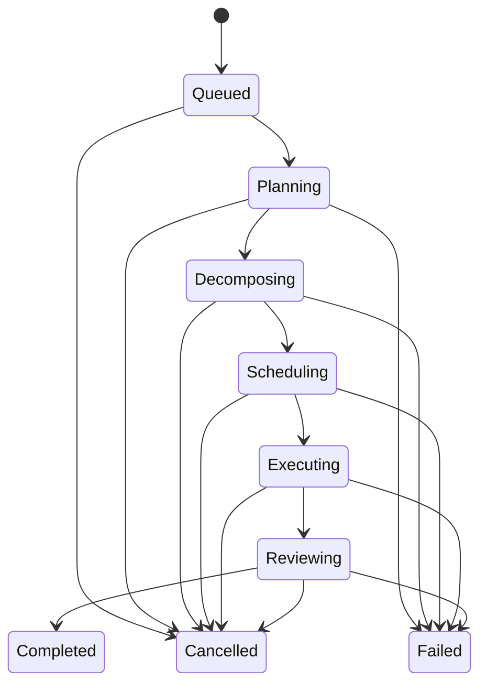
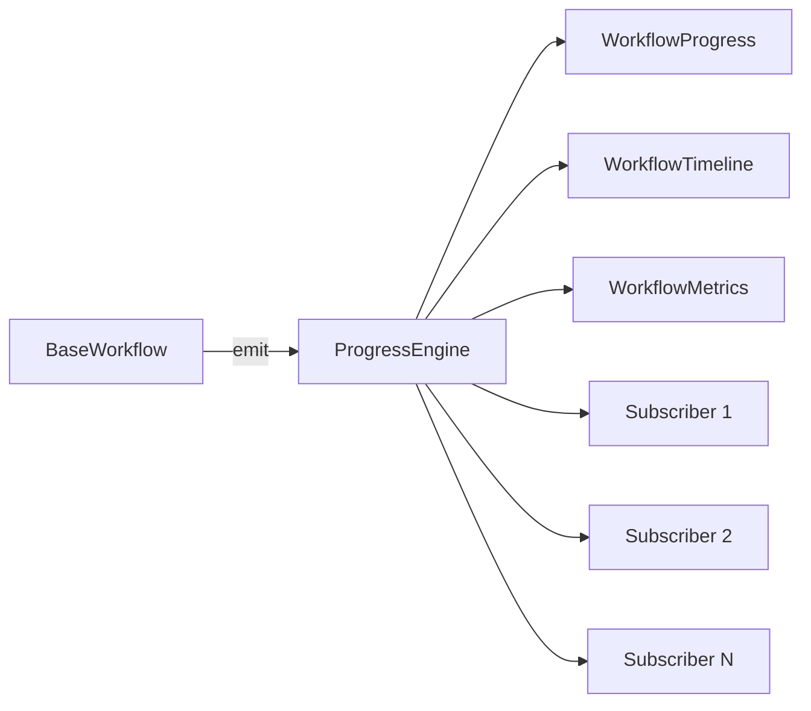

# ProgressEngine

## Responsabilidade

O `ProgressEngine` é a infraestrutura em memória responsável por observar o
ciclo de vida de qualquer `BaseWorkflow`. Ele não executa tarefas, não altera a
UI e não depende de provider, LLM, ferramenta ou fila externa.

Cada workflow possui uma instância própria. Toda mudança de lifecycle ou de
estágio gera um `WorkflowEvent` imutável e append-only.

## Estados

Os estados suportados são:

- `Queued`
- `Planning`
- `Decomposing`
- `Scheduling`
- `Executing`
- `Reviewing`
- `Completed`
- `Failed`
- `Cancelled`

## Contratos

- `WorkflowProgress`: snapshot atual, percentual, quantidade de passos,
  lifecycle e sequência do último evento;
- `WorkflowEvent`: mudança imutável com sequência, estágio anterior, timestamp,
  mensagem e metadados;
- `WorkflowStage`: catálogo fechado dos estados suportados;
- `WorkflowTimeline`: histórico append-only ordenado;
- `WorkflowMetrics`: duração total, duração por estágio, transições e
  progresso;
- `ProgressEngine`: emissão, consulta e subscription.

## Tempo real

`subscribeProgress()` recebe eventos durante a execução. A opção
`{ replay: true }` entrega primeiro toda a timeline existente e depois continua
em tempo real. Falhas de subscribers são isoladas e nunca interrompem o
workflow.

## Integração

`BaseWorkflow` emite automaticamente:

- criação e fila;
- initialize;
- pause;
- resume;
- início da execução;
- conclusão;
- falha;
- cancelamento.

O `ExecutionWorkflow` também mapeia sua cadeia interna:

| Etapa interna | WorkflowStage |
| --- | --- |
| Goal, Planner e ExecutionPlan | `Planning` |
| TaskDecomposer | `Decomposing` |
| Scheduler | `Scheduling` |
| Agentes especializados | `Executing` |
| Consensus e ChiefAgent | `Reviewing` |
| Resultado liberado | `Completed` |

O `CreativeBriefWorkflow`, que não pertence à hierarquia `BaseWorkflow`,
mantém uma instância separada por `executionId` e emite `Planning`,
`Executing`, `Reviewing`, `Completed` ou `Failed` durante o enriquecimento do
brief.

Não há integração com componentes visuais nesta etapa.
