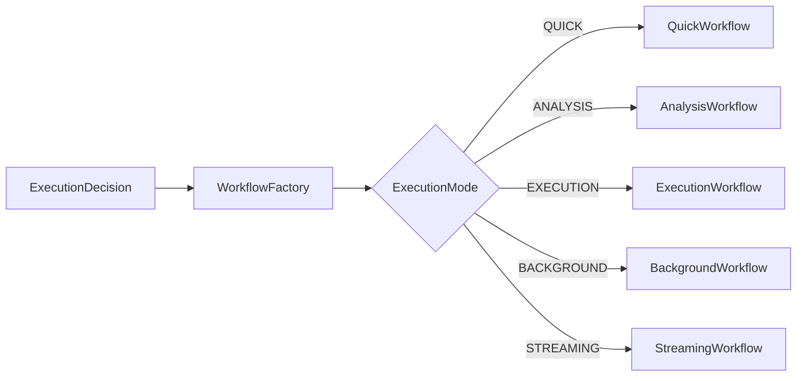
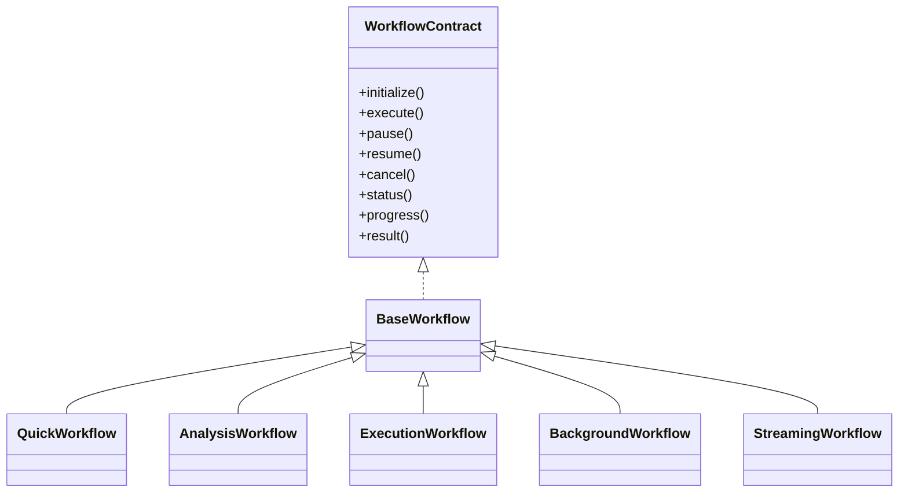
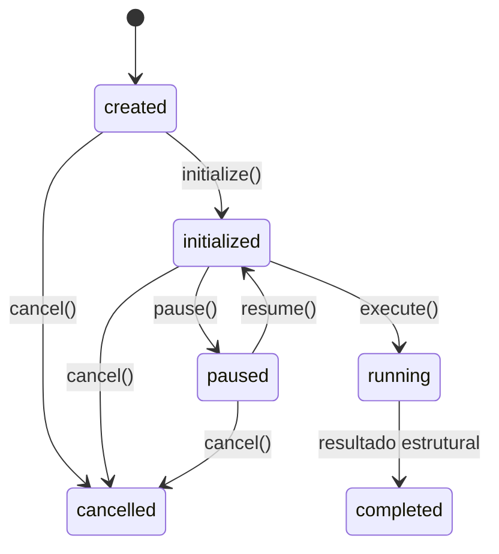
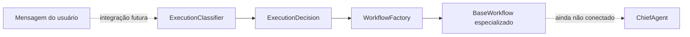

# WorkflowFactory

## Responsabilidade

O `WorkflowFactory` recebe uma `ExecutionDecision` e seleciona o tipo de
workflow correspondente ao `ExecutionMode`. Ele não conversa com modelos de
IA, não executa tarefas, não usa ferramentas e não chama agentes.

Nesta etapa, a camada está implementada e exportada, mas não está conectada ao
`ChiefAgent` nem ao runtime atual.

## Seleção

| ExecutionMode | Workflow |
| --- | --- |
| `QUICK` | `QuickWorkflow` |
| `ANALYSIS` | `AnalysisWorkflow` |
| `EXECUTION` | `ExecutionWorkflow` |
| `BACKGROUND` | `BackgroundWorkflow` |
| `STREAMING` | `StreamingWorkflow` |

## Hierarquia

Todos os workflows implementam o mesmo contrato por meio de
`BaseWorkflow`.

## Ciclo de vida

`execute()` representa somente a materialização do resultado estrutural do
workflow. Ele não percorre as etapas de `expectedWorkflow`, não aciona o
Scheduler e não executa nenhum trabalho. A execução real continuará sendo
responsabilidade do runtime quando houver uma integração futura explícita.

## Posição futura

