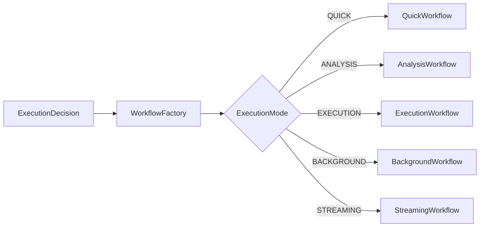
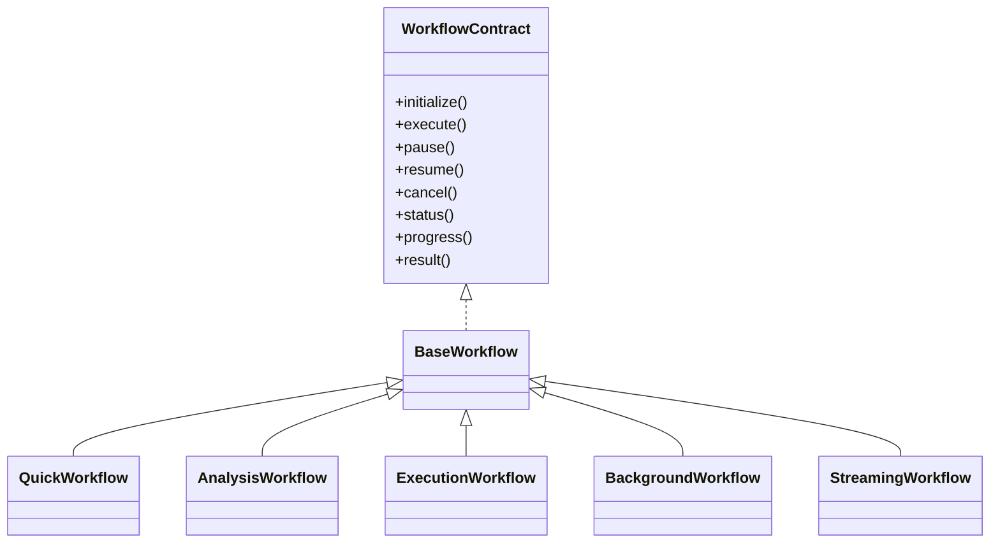
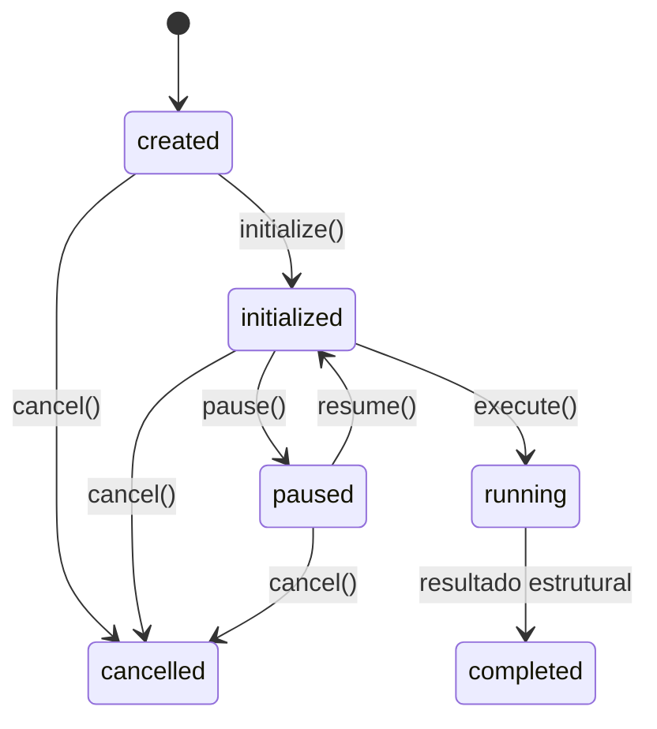
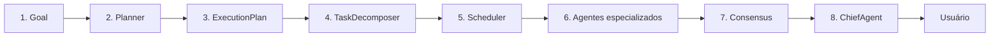
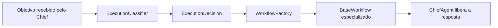

# WorkflowFactory

## Responsabilidade

O `WorkflowFactory` recebe uma `ExecutionDecision` e seleciona o tipo de
workflow correspondente ao `ExecutionMode`. Ele não conversa com modelos de
IA, não executa tarefas, não usa ferramentas e não chama agentes. No modo
`EXECUTION`, ele apenas injeta no `ExecutionWorkflow` as portas fornecidas pelo
chamador.

O `ChiefAgent` utiliza o `ExecutionWorkflow` para decisões `EXECUTION`. Os
demais modos ainda preservam seus caminhos existentes.

## Seleção

| ExecutionMode | Workflow |
| --- | --- |
| `QUICK` | `QuickWorkflow` |
| `ANALYSIS` | `AnalysisWorkflow` |
| `EXECUTION` | `ExecutionWorkflow` |
| `BACKGROUND` | `BackgroundWorkflow` |
| `STREAMING` | `StreamingWorkflow` |

## Hierarquia

Todos os workflows implementam o mesmo contrato por meio de
`BaseWorkflow`.

## Ciclo de vida

Nos workflows `QUICK`, `ANALYSIS`, `BACKGROUND` e `STREAMING`, `execute()`
continua representando somente a materialização do resultado estrutural.

No `ExecutionWorkflow`, `execute()` percorre obrigatoriamente o pipeline
transacional abaixo por meio de portas injetadas. O factory continua sem
executar qualquer estágio.

Cada fronteira é registrada no `MessageBus`, cada estágio gera um artefato no
`Blackboard` e as durações ficam disponíveis em `metrics()`. Uma falha
interrompe a sequência, registra o erro e mantém `result()` vazio.

## Posição futura

