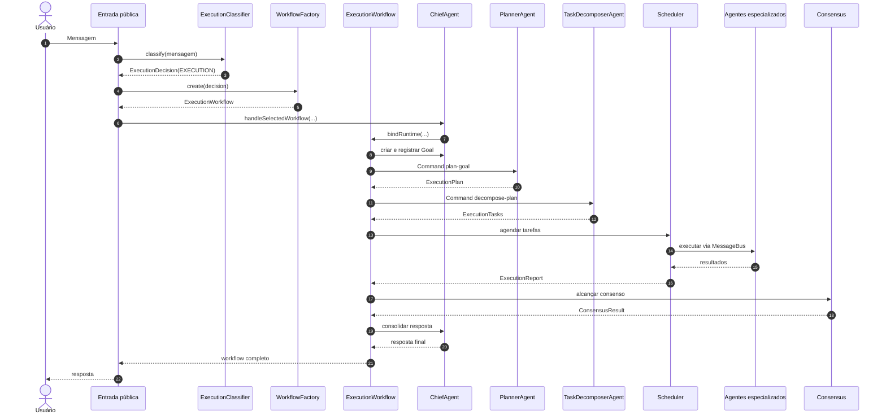
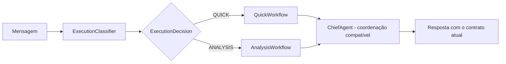
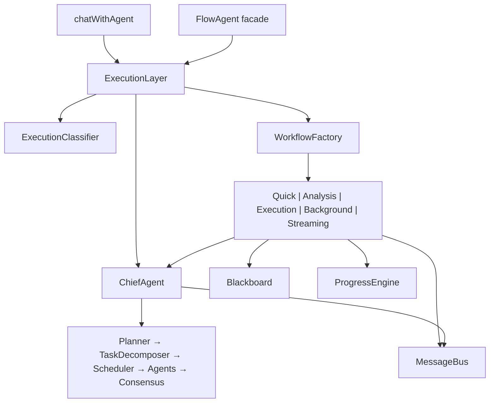

# Camada de execução multiagente

## Estado final

Toda mensagem que entra por `chatWithAgent` ou pela fachada histórica
`FlowAgent` passa primeiro por `ExecutionLayer`. A API pública dessas entradas
não mudou.

`ExecutionLayer` possui três responsabilidades:

1. classificar a mensagem com `ExecutionClassifier`;
2. selecionar e materializar um workflow com `WorkflowFactory`;
3. admitir o workflow no `ChiefAgent` e liberar a resposta somente após a
   conclusão permitida pela política.

O `ChiefAgent` continua responsável por registrar o objetivo, montar os ports
do runtime e consolidar o resultado. Ele não escolhe o workflow no caminho de
produção. O `Scheduler` continua sendo o único executor de agentes.

## Fluxo obrigatório de EXECUTION



Não existe, nas entradas de produção, chamada direta de
`chief.handleTask()`. Um objetivo pré-classificado como `EXECUTION` enviado a
`handleClassifiedTask()` gera `ExecutionPolicyViolation`. A única admissão
válida é `handleSelectedWorkflow()` com um `ExecutionWorkflow` selecionado
previamente pelo `WorkflowFactory`.

O método legado `ChiefAgent.handleTask()` foi preservado por compatibilidade
interna. Mesmo nele, um objetivo classificado como `EXECUTION` continua
obrigatoriamente dentro do `ExecutionWorkflow`; ele não oferece um caminho de
resposta direta.

## QUICK e ANALYSIS



Os workflows `QUICK` e `ANALYSIS` são inicializados e concluídos antes da
admissão no Chief. Depois disso, o comportamento de coordenação já existente é
mantido, preservando o contrato de resposta e os agentes especializados atuais.

## Logs e auditoria

Cada execução produz `ExecutionLayerAudit` com logs imutáveis nas etapas:

- `message-received`
- `classified`
- `workflow-selected`
- `workflow-started`
- `chief-admitted`
- `response-released` ou `failed`

Os registros contêm `executionId`, timestamp, modo, workflow, duração, payload
de classificação, resultado resumido e erro. Para `EXECUTION`, a auditoria do
próprio workflow complementa esses registros com todas as mensagens do
`MessageBus`, métricas de cada estágio e entradas publicadas no `Blackboard`.

`ExecutionLayer.metrics()` agrega:

- total, concluídas e falhas;
- contagem por `ExecutionMode`;
- duração média;
- métricas por execução;
- contagem de logs e traces;
- timeline e progresso do workflow.

As entradas de chat e Flow também enviam cada log estruturado ao logger da
aplicação usando o prefixo `[ExecutionLayer]`.

## Componentes e dependências



`MessageBus` é compartilhado entre `ExecutionLayer`, workflow e Chief para
manter uma trilha única de correlação. O `Blackboard` é criado por execução e
usado tanto pelo workflow selecionado quanto pelo runtime montado pelo Chief.

## Testes

Executar a validação focada:

```powershell
npm.cmd run test:execution-layer
```

Ela verifica:

1. a ordem integral do pipeline de `EXECUTION`;
2. ausência de resposta enquanto um agente ainda está executando;
3. rejeição de `EXECUTION` sem workflow selecionado;
4. compatibilidade de `QUICK`;
5. compatibilidade de `ANALYSIS`;
6. logs, traces, Blackboard e métricas.

A suíte integral inclui esse teste automaticamente:

```powershell
npm.cmd test
```
